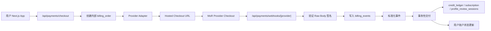
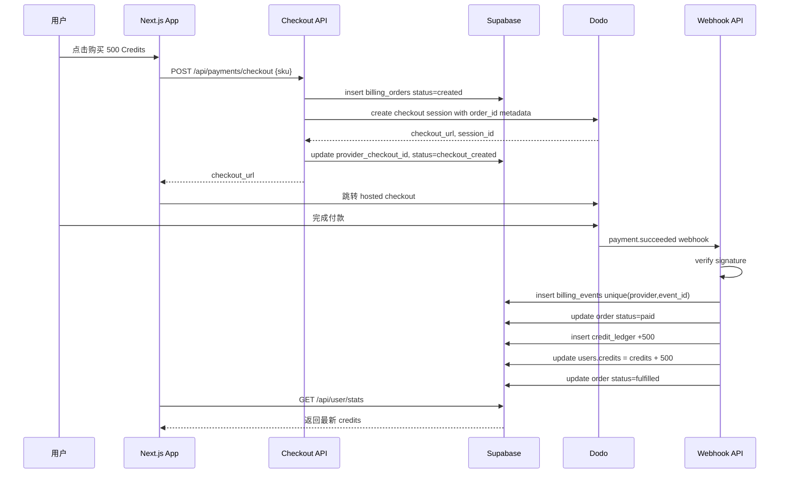
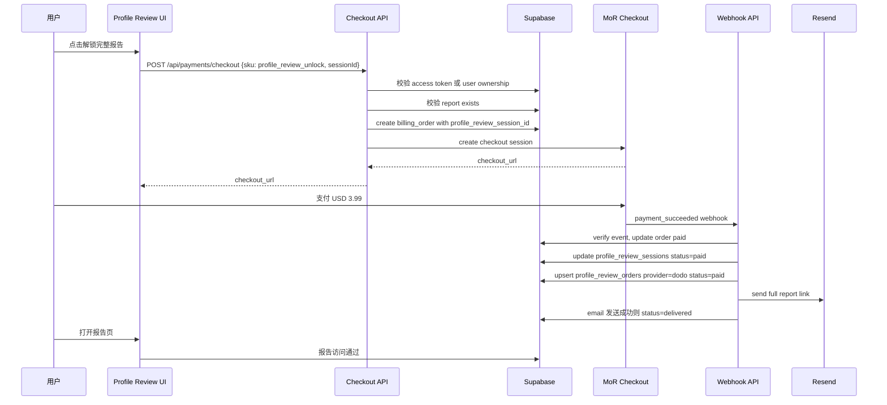
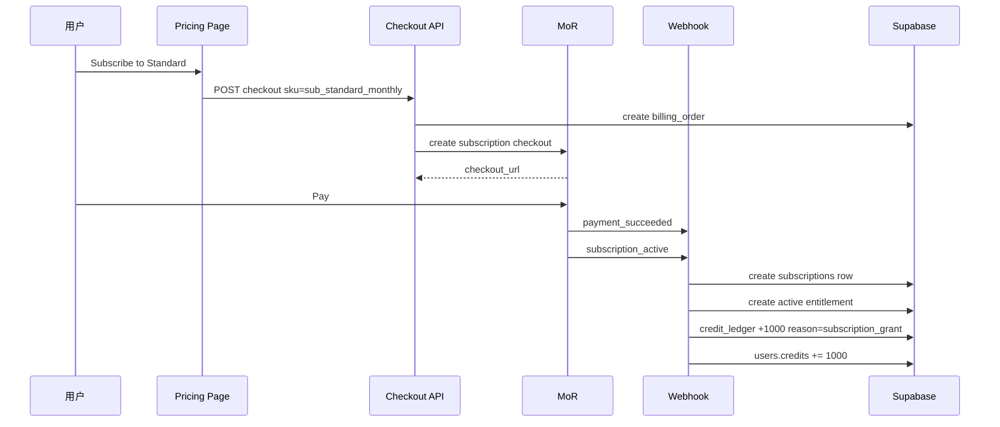
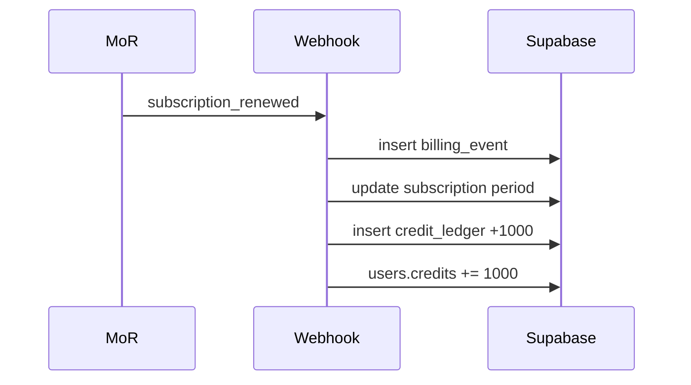
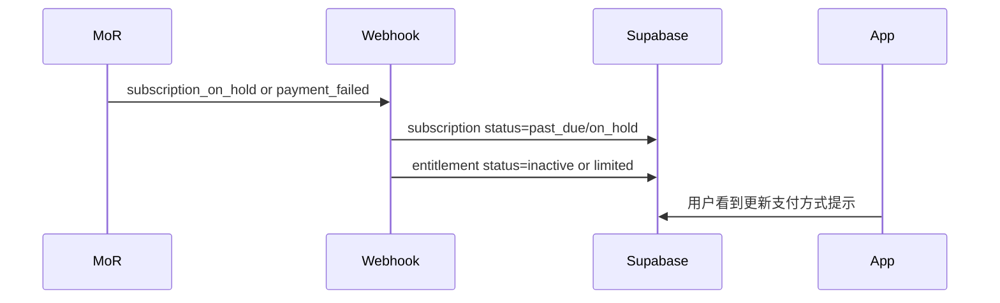
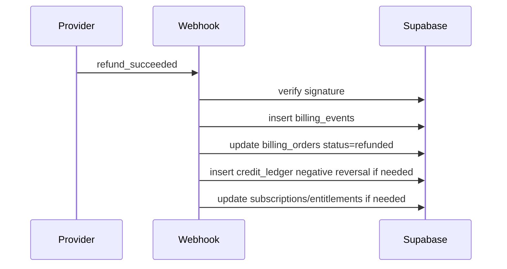
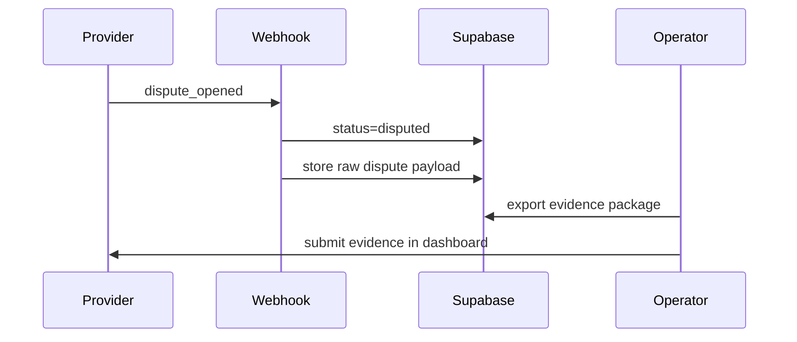
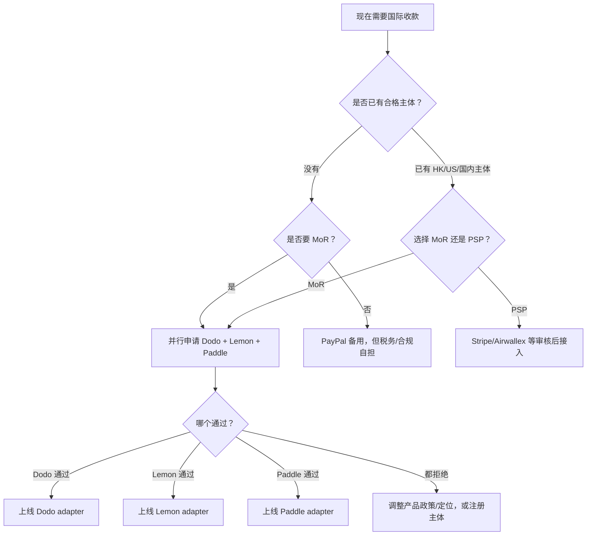

# MoR 国际支付方案

日期：2026-05-06

适用项目：`video_generator`

本文档面向当前项目的国际收款落地，覆盖 MoR 支付方案、准入条件、准备工作、平台选择、申请流程、技术实现、支持渠道、数据流示例、风控合规、测试上线和后续运营。

本文不是法律、税务、外汇或合规意见。支付平台规则、KYC 要求、制裁名单、AI 内容政策和结汇要求都可能变化。上线前必须重新核对官方文档，并就个人税务、外汇、主体注册等问题咨询合格专业人士。

## 1. 核心结论

你当前条件：

- 国内个人。
- 只有国内银行卡。
- 没有海外身份主体。
- 国内没有营业执照。
- 项目是面向国际用户的 AI 图像/视频 SaaS，包含积分包、订阅、照片评分报告解锁等付费场景。

推荐路线：

1. **优先走 MoR（Merchant of Record，商户记录方）**。
2. **并行申请 Dodo Payments、Lemon Squeezy、Paddle**，谁先审核通过就先接谁。
3. 当前项目形态下，**Dodo Payments 是最优先尝试的生产候选**，因为其官方商户接受政策明确包含 China，并明确支持 SaaS 和 AI 产品，但 AI 内容生成需要审核。
4. **Stripe 只保留为未来有主体后的适配器**。当前条件不建议直接把现有 Stripe 方案推生产。
5. **PayPal 中国可作为补充或备用收款方式，但不建议作为主链路**，因为 PayPal 不是 MoR，税务、拒付、退款、发票、销售合规责任仍主要在你身上。
6. **Airwallex 当前不适合**，因为它只提供企业账户，中国主体开户需要营业执照、授权人、UBO 等 KYC 材料。

推荐技术路线：

- 把现有 Stripe 专用链路改成统一支付域：
  - `POST /api/payments/checkout`
  - `POST /api/payments/webhooks/[provider]`
  - `POST /api/payments/portal`
- 增加支付 provider adapter：
  - `dodo`
  - `lemonsqueezy`
  - `paddle`
  - `stripe`，仅作为未来可选项
- 增加统一账务表：
  - `billing_orders`
  - `billing_order_items`
  - `billing_events`
  - `credit_ledger`
  - `subscriptions`
  - `entitlements`
- 支付成功、加积分、解锁报告、开通订阅，全部以**服务端验证过的 webhook** 为准。
- 前端支付成功跳转页只用于展示状态，不能直接加积分或解锁内容。

## 2. 当前项目支付现状

项目已有一个 Stripe 原型和一个 mock checkout 原型，但不适合直接生产上线。

### 2.1 现有 Stripe 积分包链路

相关文件：

- `lib/stripe.ts`
- `app/api/stripe/checkout/route.ts`
- `app/api/webhooks/stripe/route.ts`
- `supabase_schema.sql`

当前行为：

1. `lib/stripe.ts` 从 `STRIPE_SECRET_KEY` 初始化 Stripe client。
2. 定义三个积分包：
   - Starter：100 credits，USD 9.99
   - Popular：500 credits，USD 39.99
   - Pro：1000 credits，USD 69.99
3. `/api/stripe/checkout` 通过 Clerk 获取用户，创建 Stripe Checkout Session。
4. Stripe metadata 中存储：
   - `userId`
   - `credits`
   - `packageType`
5. `/api/webhooks/stripe` 验证 Stripe 签名。
6. 接收 `checkout.session.completed` 后调用 Supabase RPC `add_credits`。
7. 写入 `transactions` 表。

问题：

- 这套链路假设你能开通 Stripe 生产账户，但当前条件不满足。
- `transactions` 表强绑定 `stripe_payment_id`，不利于接入多 provider。
- 没有通用订单表、事件表、积分流水表。
- Webhook 中“加积分成功但写交易失败”存在账务不一致风险。
- `lib/env.ts` 把 Stripe 变量设成全局必需，切换 MoR 后会影响部署。

### 2.2 现有照片评分 mock checkout 链路

相关文件：

- `supabase/migrations/20260315_profile_review.sql`
- `app/api/profile-review/session/[sessionId]/mock-checkout/route.ts`
- `app/dating-profile-review/checkout/[sessionId]/page.tsx`

当前行为：

1. `profile_review_orders.provider` 默认是 `mock`。
2. mock checkout route 不收真实款，直接把订单标为 paid。
3. 前端 checkout 页面显示 “Mock payment” 和“不会真实扣款”。
4. 支付后解锁报告并发送邮件。

问题：

- 生产必须移除 mock 付款文案。
- 解锁报告应该改成真实支付 webhook 驱动。
- `profile_review_orders` 应该和统一的 `billing_orders` 关联，或者被统一账务模型替代。

### 2.3 当前工作区定价页

相关文件：

- `app/workspace/pricing/page.tsx`

当前行为：

- 展示 Mini、Standard、Plus 订阅计划。
- 按钮跳转到 `/workspace/account`，没有真实 checkout。

后续应改为：

- 点击按钮调用 `/api/payments/checkout`。
- 后端创建订阅 checkout。
- 通过 webhook 开通订阅和发放月度 credits。

## 3. MoR 和 PSP 的区别

### 3.1 MoR 是什么

MoR 是 Merchant of Record，中文可理解为“商户记录方”或“法定销售方”。

在 MoR 模式下：

- 客户法律上向 MoR 付款。
- MoR 是收单和税务链路中的卖方。
- MoR 通常负责：
  - 全球支付处理
  - 销售税、VAT、GST 等间接税处理
  - 发票/收据
  - 退款和拒付流程
  - 一部分欺诈和支付合规
  - PCI 相关责任
- 你作为产品方负责：
  - 产品真实交付
  - 用户支持
  - 内容合规
  - 平台规则遵守
  - 自己收到 payout 后的个人/企业税务
  - 必要时提供拒付证据

MoR 不是规避监管、税务或 KYC 的工具。它降低的是全球销售税和支付合规复杂度，不免除你作为收款人的身份、税务和内容合规责任。

### 3.2 PSP 是什么

PSP 是 Payment Service Provider，支付服务提供商。

典型 PSP：

- Stripe direct
- PayPal direct
- Airwallex Payments
- 传统银行卡收单机构

PSP 模式下：

- 你通常是法定销售方。
- 你要自己处理税务、发票、退款政策、拒付、合规和会计。
- 通常需要合格主体、税号、银行账户和更完整的商户资质。

### 3.3 为什么当前优先 MoR

你当前没有营业执照、没有海外主体，也没有海外银行账户。直接用 Stripe/Airwallex 这类 PSP，会卡在主体、税号、注册地址和银行账户上。

MoR 平台可能接受个人开发者或更轻量的商户资料，并且能承担全球销售税和支付合规的一大部分工作。因此这是当前最现实的国际收款路线。

## 4. 支付平台可行性对比

| 平台 | 类型 | 当前条件适配度 | 客户支付渠道 | 商户 payout | 主要风险 |
| --- | --- | --- | --- | --- | --- |
| Dodo Payments | MoR | 最优先尝试 | 信用卡、借记卡、PayPal、Apple Pay、Google Pay、支付宝、微信支付等，具体取决于地区和审核 | China 在官方接受商户国家列表中，具体以 KYC 审核为准 | AI 内容生成需要审核，禁止 deepfake、冒充、抓取、NSFW 等 |
| Lemon Squeezy | MoR | 适合作为备选 | 银行卡、PayPal、Apple Pay、Google Pay、支付宝、微信支付、Cash App Pay、ACH 等 | 银行或 PayPal payout | 官方禁止 dating sites/services，照片评分功能必须避免被视为约会服务 |
| Paddle | MoR | 成熟但审核风险较高 | 银行卡、UnionPay、PayPal、Apple Pay、Google Pay、支付宝需审批、iDEAL、Bancontact、BLIK 等 | Wire transfer 或 Payoneer，官方列出 CNY payout | AUP 对 dating 服务、人脸/深度伪造/高风险内容生成限制较多 |
| PayPal 中国 | PSP/钱包 | 可备用，不建议主链路 | PayPal、部分银行卡支付场景 | 支持跨境收款和结算，具体以账户能力为准 | 不是 MoR，税务、拒付、发票和合规责任仍在你身上 |
| Stripe direct | PSP | 当前不可行 | 账户合格后支持大量支付方式 | 要求开户国家本地银行账户等 | 中国大陆不是 Stripe 支持开户地区；跨国开户需要当地实体、税号、地址、电话、银行账户 |
| Stripe Atlas + Stripe | 主体注册 + PSP | 未来可选 | 美国公司和 Stripe 账户通过后可用 | 美国公司银行账户 | 有注册成本、美国税务、年审和合规维护 |
| Airwallex | 企业账户 + PSP | 当前不可行 | 审核后支持卡和本地支付方式 | 企业账户 | 只提供企业账户，中国主体需营业执照和 KYC 材料 |

## 5. 官方来源摘要

上线前请重新打开官方链接确认最新规则。

- Paddle 支持国家：Paddle 表示支持全球软件业务，除不支持/制裁国家外，中国不在不支持列表中。  
  https://www.paddle.com/help/start/intro-to-paddle/which-countries-are-supported-by-paddle
- Paddle payout：官方列出 CNY 作为支持 payout currency，并支持 wire transfer 或 Payoneer。  
  https://www.paddle.com/help/manage/get-paid/can-i-be-paid-in-my-local-currency  
  https://www.paddle.com/help/manage/get-paid/when-and-how-do-i-get-paid
- Paddle 支付方式：支持银行卡、UnionPay、PayPal、Apple Pay、Google Pay、支付宝需审批、iDEAL、Bancontact、BLIK、MB WAY 等。  
  https://www.paddle.com/help/start/intro-to-paddle/which-payment-methods-do-you-support
- Paddle AUP：限制 adult/dating 服务，以及人脸、deepfake、未经授权肖像等高风险内容生成。  
  https://www.paddle.com/help/start/intro-to-paddle/what-am-i-not-allowed-to-sell-on-paddle
- Dodo MoR：Dodo 表示自己作为 MoR 处理全球支付、税务合规、欺诈防护和监管责任。  
  https://docs.dodopayments.com/features/mor-introduction
- Dodo 商户接受政策：Dodo 列出 SaaS 和 AI 产品通常支持，China 在 accepted countries 中；AI 内容生成需要审核，禁止冒充、抓取、deepfake。  
  https://docs.dodopayments.com/miscellaneous/merchant-acceptance
- Dodo Checkout Sessions：支持统一 checkout session API，并可配置信用卡、借记卡、PayPal、支付宝、微信支付、Apple Pay、Google Pay 等 payment method。  
  https://docs.dodopayments.com/api-reference/checkout-sessions/create
- Dodo Webhook：使用 HMAC SHA256 签名验证，事件包含 `payment.succeeded`、`payment.failed`、`subscription.active`、`subscription.renewed`、`subscription.cancelled` 等。  
  https://docs.dodopayments.com/developer-resources/webhooks/intents/webhook-events-guide  
  https://docs.dodopayments.com/developer-resources/webhooks/intents/subscription
- Lemon Squeezy MoR：官方说明 Lemon Squeezy 作为 MoR 处理支付、销售税、退款/拒付和 PCI。  
  https://docs.lemonsqueezy.com/help/payments/merchant-of-record
- Lemon Squeezy 支付方式：支持银行卡、中国银联、PayPal、Apple Pay、Google Pay、支付宝、微信支付、Cash App Pay、ACH 等。  
  https://docs.lemonsqueezy.com/help/checkout/payment-methods
- Lemon Squeezy payout：支持银行或 PayPal payout，可能需要身份验证，最低 payout threshold 为 USD 50。  
  https://docs.lemonsqueezy.com/help/getting-started/getting-paid
- Lemon Squeezy 禁售品：允许软件/SaaS，但禁止 sexually oriented content、dating sites/services、marketplaces、physical goods 等。  
  https://docs.lemonsqueezy.com/help/getting-started/prohibited-products
- Stripe 全球可用地区：中国大陆不在 Stripe 支持开户地区，香港在支持地区中。  
  https://stripe.com/global
- Stripe 跨国开户要求：需要当地 legal entity、tax ID、physical location、phone number、government ID、working website、当地 physical bank account 等。  
  https://support.stripe.com/questions/requirements-to-open-a-stripe-account-in-another-country
- Stripe Atlas：可注册美国公司并配套银行/支付设置，但会带来美国公司税务和合规义务。  
  https://stripe.com/us/atlas  
  https://stripe.com/pricing
- Airwallex 开户资格：只提供 business account，不提供 personal account。  
  https://help.airwallex.com/hc/en-gb/articles/900001757026-Who-can-open-an-account-with-Airwallex
- Airwallex 中国公司 KYC：需要营业执照、授权人 ID、UBO ID、股权/控制权文件等。  
  https://help.airwallex.com/hc/en-gb/articles/900001756926-Preparing-KYC-Material-for-China-Business
- PayPal 中国：支持跨境商户服务，其协议包含 KYC/KYB/CDD 和结算服务说明。  
  https://www.paypal.com/c2/webapps/mpp/merchant  
  https://www.paypal.cn/portal/paypal-unified-account-ua?locale.x=en

## 6. 推荐平台策略

### 6.1 第一候选：Dodo Payments

推荐原因：

- China 在其 accepted merchant countries 中。
- 明确定位为 MoR。
- 明确支持 SaaS 和 AI 产品，但 AI 产品需要审核。
- Checkout Session API、metadata、hosted checkout、webhook 都适合当前 Next.js/Supabase 项目。
- 支付方式覆盖比较广，包含卡、钱包和本地支付方式。

注意事项：

- 不要宣传 NSFW、uncensored、face swap、deepfake、celebrity likeness。
- 不要把照片评分功能包装成 dating site 或 matchmaking 服务。
- 不要提供用户之间匹配、聊天、社交、约会撮合。
- 不要允许生成公众人物或未经授权真人肖像。

推荐产品描述：

- “AI image and video creation SaaS”
- “AI photo quality analysis and profile improvement report”
- “Automated digital software output”
- “No adult content, no deepfakes, no impersonation, no minors, no unauthorized likeness”

### 6.2 备选：Lemon Squeezy

推荐原因：

- 成熟 MoR。
- 适合数字产品和 SaaS。
- 支持 PayPal、支付宝、微信支付、Apple Pay、Google Pay、UnionPay 等常见支付方式。
- 银行或 PayPal payout 路径相对清晰。
- API、checkout、webhook 比较容易接入。

主要风险：

- 官方禁售品中包含 dating sites/services。
- 你的 `dating-profile-review` 当前命名和文案容易被误判为 dating service。

建议：

- 如果申请 Lemon Squeezy，必须明确说明：
  - 这是 AI 照片质量分析报告。
  - 没有用户匹配。
  - 没有聊天、约会、社交网络。
  - 没有成人内容。
  - 用户必须拥有上传图片授权。

### 6.3 成熟但风险较高：Paddle

推荐原因：

- MoR 能力成熟。
- SaaS 订阅能力强。
- 支付方式和税务处理成熟。
- 文档中列出 CNY payout 和 Payoneer/wire payout。

主要风险：

- AUP 对 dating services/applications 限制明显。
- 对人脸生成、deepfake、face swap、未经授权肖像等高风险 AI 内容非常敏感。
- 你的项目同时包含 AI 人像生成和 dating profile review，审核风险高于普通 SaaS。

建议：

- 并行申请，但不要作为唯一方案。
- 申请材料中强调：
  - 不是 dating platform。
  - 没有 face swap。
  - 没有 deepfake。
  - 没有成人内容。
  - 没有公众人物生成。
  - 有 AI 内容政策和上传授权机制。

### 6.4 不建议主用：PayPal 中国

PayPal 可以作为备用或补充：

- 可覆盖喜欢 PayPal 的国际客户。
- 可用于 B2B 手动 invoice 或特殊客户。
- 可作为部分 MoR payout 备份。

但不建议作为主架构：

- PayPal 不是 MoR。
- 你仍是销售方。
- 你要自己处理全球税务、发票、拒付、退款和合规。
- 对 SaaS 自动化交付、订阅、积分账务的后端支持不如专门 MoR 平台顺滑。

### 6.5 未来路线：Stripe / Airwallex

当以下条件满足时再考虑：

- 你注册香港公司、美国 LLC 或国内公司。
- 有对应主体银行账户。
- 有税号、注册地址、公司资料。
- 能承担公司年审、税务申报、银行合规和支付争议处理。

## 7. 上线前准备清单

### 7.1 身份和 payout 准备

准备材料：

- 身份证。
- 护照，建议准备。
- 真实姓名英文/Pinyin。
- 居住地址英文。
- 手机号。
- 邮箱。
- 国内银行卡资料。
- Payoneer 账户，作为 Paddle 备选 payout。
- 已验证 PayPal 账户，作为 Lemon Squeezy/PayPal 备选。
- 地址证明，如银行账单、水电煤账单、通信账单等。
- 税务居住地信息。
- 平台可能要求的 W-8/W-9 或类似税务声明。

禁止：

- 使用假地址。
- 借用他人账号。
- 使用代注册、代收款、壳账户。
- 用不匹配的姓名和银行账户。
- 隐瞒 AI 内容生成或人像相关功能。

### 7.2 网站准备

申请前网站必须公网可访问，建议具备：

- HTTPS 域名。
- 首页清晰说明产品。
- Pricing 页面清楚展示价格、币种、交付内容。
- 登录/注册流程。
- 产品演示或截图。
- 付款后交付流程：
  - credits 自动到账。
  - AI 生成结果进入 workspace。
  - 照片评分报告付款后解锁。
- 联系方式：
  - support email
  - 响应时间
- Terms of Service。
- Privacy Policy。
- Refund Policy。
- Acceptable Use Policy。
- AI Content Policy。
- 如果使用 cookie/analytics，要有 Cookie Policy。
- 如果接受用户上传/生成内容，要有 DMCA/IP takedown 联系方式。
- 数据删除请求入口。

### 7.3 产品文案准备

建议使用：

- “AI image and video creation workspace”
- “Automated credit-based AI generation”
- “AI photo quality review report”
- “User-uploaded images are analyzed only with user authorization”

避免使用：

- “Dating platform”
- “Find dates”
- “Match with people”
- “Generate sexy photos”
- “Uncensored AI”
- “Deepfake”
- “Face swap”
- “Generate celebrity”
- “Guaranteed more matches”
- 如果实际不是人工服务，避免写 “human expert review”

### 7.4 AI 内容安全准备

必须有：

- 禁止 NSFW/成人内容。
- 禁止未成年人相关内容。
- 禁止非自愿亲密图像。
- 禁止 deepfake、冒充、未经授权肖像。
- 禁止公众人物冒充。
- 禁止侵权、盗版、商标滥用。
- 禁止仇恨、骚扰、暴力、违法内容。
- 上传前勾选：
  - “我拥有或已获得上传图片授权”
  - “我不会上传或生成成人、违法、冒充、非自愿内容”
- prompt moderation。
- 上传图片审核。
- 输出结果审核。
- abuse report 入口。
- 违规账号暂停机制。
- 被拒生成时的积分返还机制。

### 7.5 运营准备

准备：

- `support@yourdomain.com`。
- 退款 SLA，例如 3 个工作日内响应。
- 拒付证据包：
  - order id
  - customer email
  - IP/country，如合法收集
  - product delivered timestamp
  - credit ledger
  - generation/report delivery logs
  - terms/refund policy version
- 会计导出：
  - provider statements
  - orders
  - refunds
  - disputes
  - payouts
- 数据保留规则：
  - 支付 metadata 保留多久。
  - 生成资产保留多久。
  - 用户上传照片保留多久。
  - 用户删除请求如何处理。

## 8. 完整执行流程

### 阶段 0：合规和产品清理

1. 删除所有生产可见的 “mock checkout” 文案。
2. 新增 Terms、Privacy、Refund、Acceptable Use、AI Content Policy。
3. 增加上传授权和 AI 内容政策确认框。
4. 增加 prompt/upload moderation。
5. 定价页写清：
   - 价格。
   - 币种。
   - credits 数量。
   - 订阅周期。
   - 交付内容。
   - 退款条件。

### 阶段 1：并行申请平台

同时申请：

1. Dodo Payments。
2. Lemon Squeezy。
3. Paddle。

申请材料统一准备：

- 网站 URL。
- 测试账号。
- 产品截图或 demo video。
- 产品类别：
  - SaaS
  - AI image/video generation
  - AI photo analysis/report
- 价格：
  - 一次性积分包
  - 订阅
  - 一次性报告解锁
- 交付说明：
  - webhook 确认支付后加 credits。
  - webhook 确认支付后解锁报告。
  - 生成结果保存在用户 workspace。
- 安全政策链接。
- 退款政策链接。
- support email。

针对 Dodo：

- 主动披露 AI 内容生成功能。
- 说明没有 deepfake、NSFW、冒充、抓取。

针对 Lemon Squeezy 和 Paddle：

- 主动说明 profile review 不是 dating service。
- 没有社交、聊天、匹配、约会撮合。
- 只是 AI 照片质量分析和数字报告。

### 阶段 2：Sandbox 集成

1. 在 provider dashboard 创建产品和价格。
2. 把 provider product/variant/price id 写入环境变量或数据库映射。
3. 后端创建 checkout session。
4. 使用 provider-hosted checkout。
5. 配置 webhook：
   - `https://yourdomain.com/api/payments/webhooks/dodo`
   - `https://yourdomain.com/api/payments/webhooks/lemonsqueezy`
   - `https://yourdomain.com/api/payments/webhooks/paddle`
6. 使用 raw request body 验证 webhook 签名。
7. 原始事件写入 `billing_events`。
8. provider event 转成内部 normalized event。
9. 只有 verified success event 才执行交付。

### 阶段 3：内部 QA

必须测试：

- 一次性积分包购买。
- 订阅购买。
- 订阅续费。
- 订阅取消。
- 支付失败。
- 重复 webhook。
- webhook 乱序到达。
- 退款。
- 争议/拒付，如果 sandbox 支持。
- 照片评分报告付款后解锁。
- 用户跳转 success URL 时 webhook 还没到。
- 同一邮箱对应多个 Clerk user id。

### 阶段 4：生产启用

1. 提交生产激活申请。
2. 等待账户审核通过。
3. 配置生产 API keys。
4. 配置生产 webhook endpoint。
5. 做一笔小额真实支付。
6. 做退款测试。
7. 对账 provider dashboard 和 Supabase 记录。
8. 开启真实 checkout 按钮。
9. 前 30 天每天检查订单、webhook、退款、拒付和支持邮件。

## 9. 支持的支付渠道

### 9.1 客户支付方式

建议面向国际用户展示：

- 银行卡：
  - Visa
  - Mastercard
  - American Express，视平台和地区而定
  - JCB，视平台和地区而定
  - Discover/Diners，视平台和地区而定
  - China UnionPay，视平台支持而定
- 钱包：
  - PayPal
  - Apple Pay
  - Google Pay
- 中国友好方式：
  - Alipay
  - WeChat Pay
  - UnionPay cards
- 欧洲本地方式：
  - iDEAL
  - Bancontact
  - SEPA
  - BLIK
  - MB WAY
- 其他地区：
  - Pix
  - UPI
  - local bank transfer
  - local wallets

平台差异：

- Dodo 可通过 `allowed_payment_method_types` 限制或开启部分支付方式，但官方建议保留 `credit` 和 `debit` 兜底。
- Lemon Squeezy 会根据客户地区、商品类型和支付场景自动展示可用方式。
- Paddle 同样会按地区和风控展示可用方式，支付宝等方式可能需要额外审批。

### 9.2 商户 payout 方式

推荐优先级：

1. 国内银行卡 payout，如果 provider 接受。
2. Payoneer，作为 Paddle 备选。
3. 已验证 PayPal，作为 Lemon Squeezy 备选。
4. 后续有主体后再接香港/美国/国内企业账户。

平台说明：

- Paddle：
  - 月度 payout。
  - wire transfer 或 Payoneer。
  - 官方列出 CNY payout currency。
- Lemon Squeezy：
  - bank 或 PayPal payout。
  - 最低 payout threshold 为 USD 50。
  - 银行 payout 可能转换为本地货币。
  - PayPal payout 为 USD。
- Dodo：
  - 以商户 KYC 国家和审核结果为准。
- PayPal 中国：
  - 可用于跨境收款和结算，但不是 MoR。

## 10. 推荐商品和定价模型

### 10.1 一次性积分包

| SKU | 价格 | credits | 说明 |
| --- | ---: | ---: | --- |
| `credits_starter` | USD 9.99 | 100 | 现有 starter |
| `credits_popular` | USD 39.99 | 500 | 现有 popular |
| `credits_pro` | USD 69.99 | 1000 | 现有 pro |

交付：

- webhook 成功后写入 `credit_ledger`。
- 调用原子加积分函数。
- `billing_orders.status = fulfilled`。

### 10.2 订阅套餐

| SKU | 价格 | 每月 credits | 说明 |
| --- | ---: | ---: | --- |
| `sub_mini_monthly` | USD 9/month | 500 | 当前 UI 已有 |
| `sub_standard_monthly` | USD 30/month | 1000 | 当前 UI 已有 |
| `sub_plus_monthly` | USD 60/month | 2500 | 当前 UI 已有 |

交付：

- 首次支付成功后开通 entitlement。
- 每次续费成功发放月度 credits。
- 续费失败后状态变为 `past_due` 或 `on_hold`。
- 取消后到周期结束时关闭 entitlement。

### 10.3 照片评分报告解锁

| SKU | 价格 | 交付 |
| --- | ---: | --- |
| `profile_review_unlock` | USD 3.99 | 解锁完整报告并发送邮件 |

风控说明：

- 不要在 provider 申请中称其为 dating service。
- 建议描述为 “AI photo quality review and profile improvement report”。
- 强调自动化数字报告、无社交匹配、无成人内容。

## 11. 目标技术架构



原则：

- provider-specific 代码只放在 adapter。
- 商品和价格只放在内部 catalog。
- 内部 `order_id` 是跨 provider 的稳定主键。
- provider webhook event id 必须唯一。
- 交付逻辑必须可重试、可幂等、可对账。
- success page 只展示状态，不直接交付。

## 12. 推荐文件结构

```text
lib/
  billing/
    catalog.ts
    types.ts
    orders.ts
    fulfill.ts
    events.ts
    providers/
      index.ts
      dodo.ts
      lemonsqueezy.ts
      paddle.ts
      stripe.ts
app/
  api/
    payments/
      checkout/
        route.ts
      portal/
        route.ts
      webhooks/
        [provider]/
          route.ts
  payments/
    success/
      page.tsx
    cancel/
      page.tsx
```

替换：

- `app/api/stripe/checkout/route.ts`
- `app/api/webhooks/stripe/route.ts`
- `app/api/profile-review/session/[sessionId]/mock-checkout/route.ts`

迁移：

- `CREDIT_PACKAGES` 从 `lib/stripe.ts` 移到 `lib/billing/catalog.ts`。
- Stripe 只保留在 `lib/billing/providers/stripe.ts`，默认禁用。

## 13. 内部类型设计

```ts
export type BillingProvider = "dodo" | "lemonsqueezy" | "paddle" | "stripe";

export type ProductType =
  | "credits"
  | "subscription"
  | "profile_review_unlock";

export type OrderStatus =
  | "created"
  | "checkout_created"
  | "payment_pending"
  | "paid"
  | "fulfilled"
  | "failed"
  | "cancelled"
  | "refunded"
  | "disputed";

export type NormalizedBillingEventType =
  | "payment_succeeded"
  | "payment_failed"
  | "refund_succeeded"
  | "dispute_opened"
  | "dispute_closed"
  | "subscription_active"
  | "subscription_renewed"
  | "subscription_past_due"
  | "subscription_cancelled"
  | "subscription_expired";

export interface CheckoutRequest {
  sku: string;
  productType: ProductType;
  quantity?: number;
  profileReviewSessionId?: string;
  successUrl: string;
  cancelUrl: string;
}

export interface CheckoutResponse {
  orderId: string;
  provider: BillingProvider;
  providerCheckoutId: string;
  checkoutUrl: string;
}

export interface PaymentProviderAdapter {
  provider: BillingProvider;
  createCheckout(input: {
    orderId: string;
    userId: string;
    email?: string;
    sku: string;
    amount: number;
    currency: string;
    quantity: number;
    metadata: Record<string, string>;
    successUrl: string;
    cancelUrl: string;
  }): Promise<{
    providerCheckoutId: string;
    checkoutUrl: string;
  }>;
  verifyWebhook(input: {
    rawBody: string;
    headers: Headers;
  }): Promise<NormalizedBillingEvent>;
}

export interface NormalizedBillingEvent {
  provider: BillingProvider;
  eventId: string;
  eventType: NormalizedBillingEventType;
  providerOrderId?: string;
  providerCheckoutId?: string;
  providerPaymentId?: string;
  providerSubscriptionId?: string;
  internalOrderId?: string;
  customerEmail?: string;
  amount?: number;
  currency?: string;
  occurredAt: string;
  raw: unknown;
}
```

## 14. 数据库设计

新增 migration，不要继续把所有支付数据塞进旧 `transactions` 表。

```sql
create extension if not exists "uuid-ossp";

create table if not exists billing_orders (
  id uuid primary key default uuid_generate_v4(),
  user_id text not null references users(id) on delete cascade,
  email text,
  provider text not null,
  product_type text not null check (
    product_type in ('credits', 'subscription', 'profile_review_unlock')
  ),
  sku text not null,
  status text not null default 'created' check (
    status in (
      'created',
      'checkout_created',
      'payment_pending',
      'paid',
      'fulfilled',
      'failed',
      'cancelled',
      'refunded',
      'disputed'
    )
  ),
  amount integer not null,
  currency text not null default 'usd',
  quantity integer not null default 1,
  provider_checkout_id text,
  provider_payment_id text,
  provider_customer_id text,
  provider_subscription_id text,
  metadata jsonb not null default '{}'::jsonb,
  paid_at timestamptz,
  fulfilled_at timestamptz,
  created_at timestamptz not null default now(),
  updated_at timestamptz not null default now()
);

create index if not exists idx_billing_orders_user_id
  on billing_orders(user_id, created_at desc);

create index if not exists idx_billing_orders_provider_checkout
  on billing_orders(provider, provider_checkout_id);

create index if not exists idx_billing_orders_provider_payment
  on billing_orders(provider, provider_payment_id);

create table if not exists billing_order_items (
  id uuid primary key default uuid_generate_v4(),
  order_id uuid not null references billing_orders(id) on delete cascade,
  sku text not null,
  name text not null,
  product_type text not null,
  unit_amount integer not null,
  currency text not null default 'usd',
  quantity integer not null default 1,
  credits integer,
  metadata jsonb not null default '{}'::jsonb,
  created_at timestamptz not null default now()
);

create table if not exists billing_events (
  id uuid primary key default uuid_generate_v4(),
  provider text not null,
  provider_event_id text not null,
  event_type text not null,
  order_id uuid references billing_orders(id) on delete set null,
  provider_payment_id text,
  provider_subscription_id text,
  raw_payload jsonb not null,
  received_at timestamptz not null default now(),
  processed_at timestamptz,
  processing_error text,
  unique(provider, provider_event_id)
);

create index if not exists idx_billing_events_order_id
  on billing_events(order_id);

create table if not exists credit_ledger (
  id uuid primary key default uuid_generate_v4(),
  user_id text not null references users(id) on delete cascade,
  order_id uuid references billing_orders(id) on delete set null,
  generation_id uuid references generations(id) on delete set null,
  delta integer not null,
  balance_after integer,
  reason text not null check (
    reason in (
      'purchase',
      'subscription_grant',
      'generation_spend',
      'refund',
      'admin_adjustment',
      'chargeback_reversal'
    )
  ),
  idempotency_key text not null unique,
  metadata jsonb not null default '{}'::jsonb,
  created_at timestamptz not null default now()
);

create index if not exists idx_credit_ledger_user_created
  on credit_ledger(user_id, created_at desc);

create table if not exists subscriptions (
  id uuid primary key default uuid_generate_v4(),
  user_id text not null references users(id) on delete cascade,
  provider text not null,
  provider_subscription_id text not null,
  sku text not null,
  status text not null,
  current_period_start timestamptz,
  current_period_end timestamptz,
  cancel_at_period_end boolean not null default false,
  metadata jsonb not null default '{}'::jsonb,
  created_at timestamptz not null default now(),
  updated_at timestamptz not null default now(),
  unique(provider, provider_subscription_id)
);

create table if not exists entitlements (
  id uuid primary key default uuid_generate_v4(),
  user_id text not null references users(id) on delete cascade,
  subscription_id uuid references subscriptions(id) on delete cascade,
  feature text not null,
  status text not null check (status in ('active', 'inactive')),
  starts_at timestamptz not null default now(),
  ends_at timestamptz,
  metadata jsonb not null default '{}'::jsonb,
  created_at timestamptz not null default now(),
  updated_at timestamptz not null default now()
);
```

设计理由：

- `users.credits` 是快速余额。
- `credit_ledger` 是审计流水。
- `billing_events` 保存原始 webhook，便于排错、对账和拒付证据。
- `billing_orders` 不绑定 Stripe，可兼容 Dodo、Lemon Squeezy、Paddle、Stripe。

积分更新建议做成数据库 RPC：

1. 插入 `credit_ledger`。
2. 更新 `users.credits`。
3. 返回新余额。
4. 整个过程在一个事务中完成。

## 15. 商品目录设计

`lib/billing/catalog.ts`

```ts
export const BILLING_CATALOG = {
  credits_starter: {
    sku: "credits_starter",
    productType: "credits",
    name: "Starter Credits",
    amount: 999,
    currency: "usd",
    credits: 100,
  },
  credits_popular: {
    sku: "credits_popular",
    productType: "credits",
    name: "Popular Credits",
    amount: 3999,
    currency: "usd",
    credits: 500,
  },
  credits_pro: {
    sku: "credits_pro",
    productType: "credits",
    name: "Pro Credits",
    amount: 6999,
    currency: "usd",
    credits: 1000,
  },
  sub_mini_monthly: {
    sku: "sub_mini_monthly",
    productType: "subscription",
    name: "Mini Plan",
    amount: 900,
    currency: "usd",
    interval: "month",
    monthlyCredits: 500,
  },
  sub_standard_monthly: {
    sku: "sub_standard_monthly",
    productType: "subscription",
    name: "Standard Plan",
    amount: 3000,
    currency: "usd",
    interval: "month",
    monthlyCredits: 1000,
  },
  sub_plus_monthly: {
    sku: "sub_plus_monthly",
    productType: "subscription",
    name: "Plus Plan",
    amount: 6000,
    currency: "usd",
    interval: "month",
    monthlyCredits: 2500,
  },
  profile_review_unlock: {
    sku: "profile_review_unlock",
    productType: "profile_review_unlock",
    name: "AI Profile Photo Review Report",
    amount: 399,
    currency: "usd",
  },
} as const;
```

provider product id 不要写死在 UI 中，建议用环境变量或数据库映射：

```env
DODO_PRODUCT_CREDITS_STARTER=
DODO_PRODUCT_PROFILE_REVIEW_UNLOCK=
LEMONSQUEEZY_VARIANT_CREDITS_STARTER=
PADDLE_PRICE_SUB_STANDARD_MONTHLY=
```

## 16. Checkout API 设计

接口：

```text
POST /api/payments/checkout
```

请求：

```json
{
  "sku": "credits_popular",
  "productType": "credits",
  "quantity": 1,
  "profileReviewSessionId": null
}
```

响应：

```json
{
  "orderId": "8c02a7e2-1c25-4d78-b1b9-7b26c8e476b5",
  "provider": "dodo",
  "providerCheckoutId": "chk_...",
  "checkoutUrl": "https://checkout.dodopayments.com/..."
}
```

后端步骤：

1. Clerk 认证用户。
2. 解析 canonical user id 和 email。
3. 校验 SKU 是否存在。
4. 校验上下文：
   - 报告解锁必须有 `profileReviewSessionId`。
   - 用户必须有权限访问该 session。
   - 报告必须已经生成。
5. 创建 `billing_orders`。
6. 创建 `billing_order_items`。
7. 构造 metadata：
   - `order_id`
   - `user_id`
   - `email`
   - `sku`
   - `product_type`
   - `credits` 或 `monthly_credits`
   - `profile_review_session_id`
   - `environment`
8. 调用当前 active provider adapter。
9. 保存 `provider_checkout_id`。
10. 返回 `checkoutUrl`。

永远不要信任前端传来的：

- amount
- credits
- provider
- user id
- order status

## 17. Webhook API 设计

接口：

```text
POST /api/payments/webhooks/[provider]
```

示例：

```text
POST /api/payments/webhooks/dodo
POST /api/payments/webhooks/lemonsqueezy
POST /api/payments/webhooks/paddle
POST /api/payments/webhooks/stripe
```

处理步骤：

1. 读取 raw body。
2. 用 provider webhook secret 验证签名。
3. 转成 normalized event。
4. 插入 `billing_events`。
5. 如果 `provider + provider_event_id` 已存在，说明是重复 webhook，直接返回 200。
6. 根据 metadata 或 provider id 找到内部 `order_id`。
7. 在事务中：
   - 更新订单状态。
   - 成功支付则交付。
   - 写积分流水、订阅或报告解锁。
   - 标记 event processed。
8. 返回 200。

不要做：

- 签名前先改写 body。
- 从前端 success redirect 执行交付。
- 重复 webhook 时再次加积分。
- provider 事件未识别就直接交付。

## 18. Provider Adapter 示例

### 18.1 Dodo Checkout

```ts
import DodoPayments from "dodopayments";

export async function createDodoCheckout(input: CreateCheckoutInput) {
  const client = new DodoPayments({
    bearerToken: process.env.DODO_PAYMENTS_API_KEY,
  });

  const providerProductId = resolveDodoProductId(input.sku);

  const session = await client.checkoutSessions.create({
    product_cart: [
      {
        product_id: providerProductId,
        quantity: input.quantity,
      },
    ],
    return_url: input.successUrl,
    cancel_url: input.cancelUrl,
    metadata: input.metadata,
    allowed_payment_method_types: [
      "credit",
      "debit",
      "paypal",
      "apple_pay",
      "google_pay",
      "ali_pay",
      "we_chat_pay",
    ],
  });

  return {
    providerCheckoutId: session.session_id,
    checkoutUrl: session.checkout_url,
  };
}
```

注意：

- 限制 payment methods 时保留 `credit` 和 `debit` 兜底。
- 支付方式是否展示取决于客户地区、平台设置和商户审核。
- 订阅要使用 Dodo subscription product，并处理 `subscription.*` 事件。

### 18.2 Lemon Squeezy Checkout

```ts
export async function createLemonCheckout(input: CreateCheckoutInput) {
  const variantId = resolveLemonVariantId(input.sku);

  const response = await fetch("https://api.lemonsqueezy.com/v1/checkouts", {
    method: "POST",
    headers: {
      Accept: "application/vnd.api+json",
      "Content-Type": "application/vnd.api+json",
      Authorization: `Bearer ${process.env.LEMONSQUEEZY_API_KEY}`,
    },
    body: JSON.stringify({
      data: {
        type: "checkouts",
        attributes: {
          checkout_data: {
            email: input.email,
            custom: input.metadata,
          },
          product_options: {
            redirect_url: input.successUrl,
          },
        },
        relationships: {
          store: {
            data: {
              type: "stores",
              id: process.env.LEMONSQUEEZY_STORE_ID,
            },
          },
          variant: {
            data: {
              type: "variants",
              id: variantId,
            },
          },
        },
      },
    }),
  });

  const json = await response.json();

  return {
    providerCheckoutId: String(json.data.id),
    checkoutUrl: json.data.attributes.url,
  };
}
```

注意：

- 用 custom data 存 `order_id`。
- Webhook 用 `X-Signature` HMAC SHA256 验证。
- 一次性商品可用 `order_created` 触发交付。
- 订阅用 subscription events。

### 18.3 Paddle Checkout

Paddle 可通过 Paddle.js 或 transaction API。前端打开 checkout 示例：

```ts
Paddle.Checkout.open({
  items: [
    {
      priceId: "pri_...",
      quantity: 1,
    },
  ],
  customData: {
    order_id: "internal-order-id",
    user_id: "clerk-user-id",
    sku: "sub_standard_monthly",
  },
  settings: {
    successUrl: "https://yourdomain.com/payments/success",
  },
});
```

后端仍必须：

- 创建内部 order。
- 验证 Paddle webhooks。
- 只在 `transaction.completed` 或订阅生命周期事件后交付。

注意：

- Paddle 的 `transaction.paid` 可能早于完整交易处理完成。
- 一次性购买建议用 `transaction.completed` 做 provisioning。
- 订阅监听 `subscription.activated`、`subscription.updated`、`subscription.past_due`、`subscription.canceled`。

### 18.4 Stripe 未来适配器

Stripe 只保留为未来有主体后的 adapter：

```ts
const session = await stripe.checkout.sessions.create({
  line_items: [
    {
      price_data: {
        currency: input.currency,
        product_data: {
          name: input.name,
        },
        unit_amount: input.amount,
      },
      quantity: input.quantity,
    },
  ],
  mode: input.productType === "subscription" ? "subscription" : "payment",
  success_url: input.successUrl,
  cancel_url: input.cancelUrl,
  metadata: input.metadata,
  payment_intent_data: {
    metadata: input.metadata,
  },
});
```

不要在 `BILLING_PROVIDER` 不是 `stripe` 时强制要求 `STRIPE_SECRET_KEY`。

## 19. Provider 事件映射

把所有 provider 事件转成内部统一事件。

| 内部事件 | Dodo | Lemon Squeezy | Paddle | Stripe |
| --- | --- | --- | --- | --- |
| `payment_succeeded` | `payment.succeeded` | `order_created` | `transaction.completed` | `checkout.session.completed` 或 `payment_intent.succeeded` |
| `payment_failed` | `payment.failed` | 失败支付事件 | `transaction.payment_failed` | `payment_intent.payment_failed` |
| `refund_succeeded` | refund events | `order_refunded` | refund/adjustment events | `charge.refunded` |
| `dispute_opened` | dispute events | dispute/chargeback events | adjustment/dispute events | `charge.dispute.created` |
| `subscription_active` | `subscription.active` | `subscription_created` 或 active 状态 | `subscription.activated` | active subscription |
| `subscription_renewed` | `subscription.renewed` + payment success | `subscription_payment_success` | recurring `transaction.completed` | invoice/payment succeeded |
| `subscription_past_due` | `subscription.on_hold` | payment failed/past due | `subscription.past_due` | subscription past_due |
| `subscription_cancelled` | `subscription.cancelled` | `subscription_cancelled` | `subscription.canceled` | `customer.subscription.deleted` |

生产上线前必须在 provider dashboard 中核对准确事件名。内部标准化层的作用，就是不让 provider 差异扩散到业务逻辑。

## 20. 数据流示例一：一次性积分包购买

场景：

- 用户购买 `credits_popular`。
- 价格 USD 39.99。
- 发放 500 credits。
- Provider 为 Dodo。



内部订单示例：

```json
{
  "id": "8c02a7e2-1c25-4d78-b1b9-7b26c8e476b5",
  "user_id": "user_abc",
  "provider": "dodo",
  "product_type": "credits",
  "sku": "credits_popular",
  "status": "checkout_created",
  "amount": 3999,
  "currency": "usd",
  "provider_checkout_id": "chk_123",
  "metadata": {
    "credits": "500",
    "environment": "production"
  }
}
```

标准化 webhook 示例：

```json
{
  "provider": "dodo",
  "eventId": "evt_123",
  "eventType": "payment_succeeded",
  "providerCheckoutId": "chk_123",
  "providerPaymentId": "pay_123",
  "internalOrderId": "8c02a7e2-1c25-4d78-b1b9-7b26c8e476b5",
  "amount": 3999,
  "currency": "usd",
  "occurredAt": "2026-05-06T10:00:00.000Z"
}
```

积分流水示例：

```json
{
  "user_id": "user_abc",
  "order_id": "8c02a7e2-1c25-4d78-b1b9-7b26c8e476b5",
  "delta": 500,
  "reason": "purchase",
  "idempotency_key": "dodo:payment_succeeded:evt_123:credits"
}
```

## 21. 数据流示例二：照片评分报告解锁

场景：

- 匿名用户完成问卷并上传照片。
- Trigger.dev 生成预览报告和完整报告。
- 用户登录 Clerk。
- 用户支付 USD 3.99。
- webhook 解锁完整报告并发送邮件。

前置状态：

- `profile_review_sessions.status = analyzed`
- `profile_review_reports` 已存在
- 用户有 session 访问权限



传给 provider 的 metadata：

```json
{
  "order_id": "billing-order-uuid",
  "user_id": "user_abc",
  "sku": "profile_review_unlock",
  "product_type": "profile_review_unlock",
  "profile_review_session_id": "profile-session-uuid"
}
```

注意：

- 邮件发送失败不应回滚已付款订单。
- 邮件失败应该进入后台重试。
- 只要站内报告可访问，付款就已经交付了一部分核心价值。
- 邮件失败可以提示用户重发，不要自动退款。

## 22. 数据流示例三：订阅和月度 credits

场景：

- 用户订阅 `sub_standard_monthly`。
- USD 30/month。
- 每月发放 1000 credits。

首次购买：



续费：



续费失败：



## 23. 数据流示例四：退款和拒付

退款策略：

- 用户购买 credits 但未使用：
  - 可以退还。
  - 减去未使用 credits。
- credits 已部分使用：
  - 按政策部分退款，或者不退款。
  - 可以允许负余额，或只退未使用部分。
- 报告已交付：
  - 通常只在重复扣款、技术不可访问等情况退款。
- 出现 chargeback：
  - 暂停订阅或 entitlement。
  - 保存争议事件。
  - 准备证据包。

退款 webhook：



拒付流程：



## 24. 幂等和事务规则

每个 webhook 都必须允许重复投递。

规则：

- `billing_events(provider, provider_event_id)` 唯一。
- `credit_ledger.idempotency_key` 唯一。
- 一个 paid order 只能 fulfilled 一次。
- 一个订阅周期只能发放一次 credits。
- 一个退款事件只能反向处理一次。

伪代码：

```ts
async function handleNormalizedEvent(event: NormalizedBillingEvent) {
  const inserted = await insertBillingEventIfNew(event);
  if (!inserted) {
    return { duplicate: true };
  }

  await db.transaction(async (tx) => {
    const order = await resolveOrderForEvent(tx, event);
    if (!order) {
      await markEventError(tx, event, "Order not found");
      return;
    }

    if (event.eventType === "payment_succeeded") {
      await markOrderPaid(tx, order, event);
      await fulfillOrderOnce(tx, order, event);
    }

    if (event.eventType === "refund_succeeded") {
      await reverseFulfillmentIfNeeded(tx, order, event);
    }

    if (event.eventType.startsWith("subscription_")) {
      await syncSubscription(tx, order, event);
    }

    await markEventProcessed(tx, event);
  });
}
```

## 25. 交付逻辑

### 25.1 积分包交付

```ts
async function fulfillCreditsOrder(tx, order, event) {
  const credits = Number(order.metadata.credits);

  await insertCreditLedger(tx, {
    userId: order.user_id,
    orderId: order.id,
    delta: credits,
    reason: "purchase",
    idempotencyKey: `${event.provider}:${event.eventId}:credits`,
  });

  await addCreditsAtomic(tx, order.user_id, credits);

  await markOrderFulfilled(tx, order.id);
}
```

### 25.2 报告解锁交付

```ts
async function fulfillProfileReviewUnlock(tx, order, event) {
  const sessionId = String(order.metadata.profile_review_session_id || "");

  await updateProfileReviewSession(tx, sessionId, {
    user_id: order.user_id,
    status: "paid",
    paid_at: new Date().toISOString(),
  });

  await upsertProfileReviewOrder(tx, {
    sessionId,
    userId: order.user_id,
    amount: order.amount,
    currency: order.currency,
    status: "paid",
    provider: order.provider,
    providerOrderId: event.providerPaymentId || event.providerCheckoutId,
  });

  await markOrderFulfilled(tx, order.id);
}
```

邮件建议通过后台任务发送。不要把邮件发送放进数据库事务里，否则邮件失败可能导致有效支付回滚。

### 25.3 订阅 credits 发放

```ts
async function grantMonthlySubscriptionCredits(tx, subscription, event) {
  const monthlyCredits = resolveMonthlyCredits(subscription.sku);

  await insertCreditLedger(tx, {
    userId: subscription.user_id,
    orderId: null,
    delta: monthlyCredits,
    reason: "subscription_grant",
    idempotencyKey: `${event.provider}:${event.eventId}:monthly-credits`,
  });

  await addCreditsAtomic(tx, subscription.user_id, monthlyCredits);
}
```

## 26. 前端交互设计

### 26.1 Checkout 按钮

按钮流程：

1. 调用 `/api/payments/checkout`。
2. loading 期间禁用按钮。
3. 成功后跳转 `checkoutUrl`。
4. 不在前端直接加 credits 或解锁报告。

### 26.2 Success 页面

Success 页面应该：

- 读取 `orderId`。
- 轮询 `/api/payments/orders/[orderId]`。
- 展示：
  - `Processing payment...`
  - `Payment confirmed`
  - `Payment pending`
  - 超时后提示联系 support

### 26.3 Cancel 页面

Cancel 页面应该：

- 不做交付。
- 允许用户重新支付。
- 保留 abandoned order 做转化分析。

### 26.4 Account 页面

建议新增：

- 当前 credits。
- credit ledger。
- order history。
- provider receipt/invoice 链接。
- subscription status。
- manage subscription 按钮。

## 27. 环境变量设计

一次只启用一个主 provider：

```env
BILLING_PROVIDER=dodo
NEXT_PUBLIC_APP_URL=https://yourdomain.com

# Dodo
DODO_PAYMENTS_API_KEY=
DODO_PAYMENTS_WEBHOOK_KEY=
DODO_PRODUCT_CREDITS_STARTER=
DODO_PRODUCT_CREDITS_POPULAR=
DODO_PRODUCT_CREDITS_PRO=
DODO_PRODUCT_PROFILE_REVIEW_UNLOCK=
DODO_PRODUCT_SUB_MINI_MONTHLY=
DODO_PRODUCT_SUB_STANDARD_MONTHLY=
DODO_PRODUCT_SUB_PLUS_MONTHLY=

# Lemon Squeezy
LEMONSQUEEZY_API_KEY=
LEMONSQUEEZY_WEBHOOK_SECRET=
LEMONSQUEEZY_STORE_ID=
LEMONSQUEEZY_VARIANT_CREDITS_STARTER=
LEMONSQUEEZY_VARIANT_PROFILE_REVIEW_UNLOCK=

# Paddle
PADDLE_API_KEY=
PADDLE_WEBHOOK_SECRET=
PADDLE_CLIENT_TOKEN=
PADDLE_ENVIRONMENT=sandbox
PADDLE_PRICE_CREDITS_STARTER=
PADDLE_PRICE_SUB_STANDARD_MONTHLY=

# Stripe future only
STRIPE_SECRET_KEY=
STRIPE_WEBHOOK_SECRET=
NEXT_PUBLIC_STRIPE_PUBLISHABLE_KEY=
```

校验规则：

- Supabase 和 Clerk 必需。
- active provider 变量必需。
- inactive provider 变量可选。
- `BILLING_PROVIDER != stripe` 时不要求 Stripe 变量。

## 28. 安全要求

支付安全：

- 验证 webhook 签名。
- 全站 HTTPS。
- 保存 raw webhook payload。
- provider event id 唯一。
- 不存储卡号。
- secret 不进前端。
- checkout 只能后端创建。
- service role 只在 server route/task 使用。

业务安全：

- checkout request 必须认证。
- order ownership 必须校验。
- 用户不能购买或解锁别人的 report session。
- 用户上传照片使用 private bucket 和 signed URL。
- 限流 checkout、upload、generation。
- 记录关键审计日志。

内容安全：

- prompt moderation。
- upload moderation。
- output moderation。
- abuse report。
- 违规账号封禁。
- 拒绝高风险内容并说明原因。

## 29. 对账方案

每日对账：

- 导出 provider orders/payments。
- 对比 `billing_orders`。
- 对比 paid events 和 fulfilled orders。
- 检查未处理 `billing_events`。
- 检查 paid 但未 fulfilled 的订单。
- 检查 fulfilled 但没有 provider paid event 的订单。
- 检查 `credit_ledger` 合计和 `users.credits` 是否一致。

SQL 示例：

```sql
-- 已支付但未交付
select *
from billing_orders
where status = 'paid'
  and fulfilled_at is null;

-- webhook 处理错误
select *
from billing_events
where processing_error is not null
order by received_at desc;

-- 重复 provider payment id
select provider, provider_payment_id, count(*)
from billing_orders
where provider_payment_id is not null
group by provider, provider_payment_id
having count(*) > 1;

-- ledger 和余额不一致
select
  u.id,
  u.credits as current_balance,
  coalesce(sum(l.delta), 0) as ledger_balance
from users u
left join credit_ledger l on l.user_id = u.id
group by u.id, u.credits
having u.credits <> coalesce(sum(l.delta), 0);
```

月度对账：

- 下载 provider statement。
- 下载 payout statement。
- 匹配 gross sales、tax、fees、refunds、disputes、net payout。
- 归档账务文件。
- 记录本地税务申报需要的数据。

## 30. 退款政策建议

建议写清：

- 积分包：
  - 7 天内未使用 credits 可退款。
  - 部分使用可按比例退款或按政策拒绝。
- AI 生成：
  - 生成失败自动退 credits。
  - 已成功交付的生成结果通常不退款。
- 照片评分报告：
  - 报告未生成或无法访问可退款。
  - 已交付完整报告通常不退款，除非重复扣款或技术不可达。
- 订阅：
  - 可随时取消。
  - 权益保留到周期结束。
  - 一般不追溯退款，除非重复扣款或严重服务故障。

MoR 平台自己的买家保护和退款规则可能覆盖你的网站政策。

## 31. 拒付证据包

必须能快速导出：

- `billing_order.id`
- provider order/payment id
- customer email
- customer account id
- checkout timestamp
- webhook timestamp
- product SKU/name
- amount/currency
- IP/country，如合法收集
- terms/refund policy version
- credit ledger row
- generated asset/report delivery timestamp
- report email sent timestamp
- support conversation

原则：证据足够即可，不要过度收集个人数据。

## 32. 测试计划

### 32.1 单元测试

测试：

- catalog SKU 校验。
- checkout request 校验。
- metadata builder。
- provider event normalization。
- idempotency key 生成。
- 根据 product type 路由 fulfillment。
- refund reversal 计算。

### 32.2 集成测试

测试：

- 创建 credits checkout。
- 创建 profile review unlock checkout。
- 处理 successful webhook。
- 重放相同 webhook。
- 处理 failed payment。
- 处理 refund webhook。
- 处理 subscription active/renewal/cancelled。
- order ownership。

### 32.3 手动 sandbox 测试

每个 provider 都要测：

- sandbox checkout success。
- sandbox card failure。
- duplicate webhook replay。
- dashboard refund。
- webhook signature failure。
- metadata 缺失。
- success redirect 早于 webhook。
- 用户反复刷新 success page。

### 32.4 生产 smoke test

审核通过后：

1. 用真实卡支付 USD 3.99。
2. 确认 provider dashboard 已 paid。
3. 确认 `billing_orders.status = fulfilled`。
4. 确认 credits 或报告已经交付。
5. 在 provider dashboard 退款。
6. 确认 refund webhook 正确反向处理。

## 33. 从现有代码迁移步骤

### Step 1：抽出商品目录

移动：

- `lib/stripe.ts` 中的 `CREDIT_PACKAGES`

到：

- `lib/billing/catalog.ts`

### Step 2：新增统一 checkout route

新增：

- `app/api/payments/checkout/route.ts`

更新：

- `app/pricing/page.tsx`
- `app/workspace/pricing/page.tsx`
- `app/dating-profile-review/checkout/[sessionId]/page.tsx`

### Step 3：新增统一 webhook route

新增：

- `app/api/payments/webhooks/[provider]/route.ts`

旧 Stripe webhook 暂时保留，但标记 deprecated。

### Step 4：替换 mock checkout

替换：

- `app/api/profile-review/session/[sessionId]/mock-checkout/route.ts`

改成：

- `POST /api/payments/checkout`
- `sku = profile_review_unlock`

### Step 5：新增 ledger

新增：

- `credit_ledger`
- 原子 ledger + balance RPC

然后：

- payment fulfillment 使用 ledger。
- generation 消费 credits 后续也使用 ledger。

### Step 6：provider 配置

修改 `lib/env.ts`：

- Stripe 不再全局必需。
- 只校验 active provider keys。

### Step 7：订单历史 UI

新增：

- order list。
- credit ledger list。
- subscription state。
- manage subscription link。

### Step 8：处理旧 `transactions`

推荐：

- 第一阶段保留旧 `transactions` 只读。
- MoR 稳定后再迁移到 `billing_orders` 和 `billing_events`。

## 34. Provider 申请材料模板

可直接改成英文提交：

```text
Product name:
AI Video & Image Generator

Website:
https://yourdomain.com

Product category:
SaaS, AI image/video generation, AI photo analysis report.

Product description:
Users buy credits or subscribe to generate AI images/videos and receive automated digital outputs inside their account workspace. We also offer an AI profile photo quality review report. The report is generated automatically from user-uploaded photos and questionnaire answers, then delivered digitally after payment.

Delivery:
All products are digital and delivered automatically. Credits are added to the user's account after payment confirmation by webhook. Generated images/videos appear in the user's workspace. Profile review reports are unlocked on-site and emailed after successful payment.

Safety:
We prohibit NSFW/adult content, minors, non-consensual imagery, deepfakes, impersonation, public figure likeness generation, copyright infringement, scraping, spam, and illegal content. Users must confirm they own or have permission to upload images.

Refunds:
Unused credit purchases may be refunded according to our refund policy. Failed generations automatically return credits. Delivered digital reports are refundable only for duplicate charges or technical non-delivery.

Support:
support@yourdomain.com

Policies:
Terms: https://yourdomain.com/terms
Privacy: https://yourdomain.com/privacy
Refund: https://yourdomain.com/refund
Acceptable Use: https://yourdomain.com/acceptable-use
AI Content Policy: https://yourdomain.com/ai-content-policy
```

说明：文档主体使用中文，但给支付平台提交的申请文本通常需要英文，所以保留英文模板是有实际必要的。

## 35. 合规页面大纲

### 35.1 Terms of Service

应包含：

- 服务描述。
- 账户规则。
- 付款条款。
- credits 和 subscriptions。
- 退款。
- 内容所有权。
- 用户上传授权。
- 禁止内容。
- 账号终止。
- 责任限制。
- 适用法律占位。

### 35.2 Privacy Policy

应包含：

- 账户数据。
- 支付 provider 数据。
- 上传图片。
- 生成输出。
- AI 处理说明。
- 存储 provider。
- 邮件发送。
- Analytics。
- 数据保留。
- 删除请求。
- 跨境传输。

### 35.3 Refund Policy

应包含：

- credits 退款条件。
- 订阅取消。
- 报告退款条件。
- 重复扣款处理。
- 生成失败 credits 返还。
- support 联系方式和处理时效。

### 35.4 Acceptable Use Policy

应禁止：

- 成人/NSFW。
- 未成年人。
- 非自愿亲密图像。
- deepfake/冒充。
- 未授权公众人物肖像。
- 仇恨/骚扰/暴力。
- 违法活动。
- IP 侵权。
- spam/scraping。
- malware。
- 受监管服务。

### 35.5 AI Content Policy

应包含：

- 用户对 prompt/upload 负责。
- 禁止未经授权肖像。
- 禁止 face swap/deepfake。
- 禁止误导性合成媒体。
- 平台可审核、拒绝、删除内容。
- 违规可暂停账号。
- 申诉/联系流程。

## 36. 市场上线顺序

推荐顺序：

1. 美国、加拿大、英国、澳大利亚、欧盟。
2. 香港、新加坡、日本、韩国。
3. Provider 明确批准后再重点展示支付宝、微信支付、UnionPay。
4. 根据转化数据增加本地支付方式。

理由：

- 初期卡和 PayPal 足够验证需求。
- 本地支付方式可能增加审核复杂度。
- AI 图像/视频产品初期应优先控制拒付率和风控风险。

## 37. 风险登记表

| 风险 | 严重度 | 缓解措施 |
| --- | --- | --- |
| Provider 拒绝 AI/dating 相关产品 | 高 | 改成 AI photo analysis/report 定位，明确不是 dating platform |
| 因政策不匹配导致账户冻结 | 高 | 申请时完整披露，禁止高风险内容 |
| 用户不理解 credits 交付导致拒付 | 高 | 清晰订单历史、交付日志、support 响应 |
| 重复 webhook 导致重复加 credits | 高 | unique event id + unique ledger idempotency key |
| 前端 success 直接解锁 | 高 | 只允许 webhook fulfillment |
| credits 已使用后退款 | 中 | 明确退款政策，使用负向 ledger 或部分退款 |
| AI NSFW/deepfake 滥用 | 高 | moderation、AUP、账号暂停 |
| 税务和 payout 申报不确定 | 中 | 保存 statement，咨询会计/税务专业人士 |
| 旧 Stripe env 阻塞部署 | 中 | active provider env validation |

## 38. 前 30 天运营

每日：

- 查看 provider dashboard。
- 查看 failed webhook。
- 查看 paid but unfulfilled orders。
- 查看 support inbox。
- 查看 refunds 和 disputes。

每周：

- 导出 orders。
- 和 Supabase 对账。
- 观察 refund/chargeback rate。
- 复盘 abuse report。
- 看不同国家/支付方式转化。

每月：

- 下载 provider statement。
- 下载 payout statement。
- 归档会计材料。
- 评估是否增加第二 provider 或支付方式。

## 39. 决策树



## 40. 执行 Checklist

业务准备：

- [ ] 域名和 HTTPS。
- [ ] 产品页面上线。
- [ ] Pricing 明确。
- [ ] Contact/support email 可用。
- [ ] Terms 上线。
- [ ] Privacy Policy 上线。
- [ ] Refund Policy 上线。
- [ ] Acceptable Use Policy 上线。
- [ ] AI Content Policy 上线。
- [ ] 上传授权 checkbox。
- [ ] Abuse report/support 流程。

Provider：

- [ ] Dodo application submitted。
- [ ] Lemon Squeezy application submitted。
- [ ] Paddle application submitted。
- [ ] Provider product IDs created。
- [ ] Payout method configured。
- [ ] Webhook endpoint configured。
- [ ] Webhook secret stored。
- [ ] Sandbox tests completed。
- [ ] Production activation approved。

技术：

- [ ] `lib/billing/catalog.ts`。
- [ ] `lib/billing/providers`。
- [ ] `POST /api/payments/checkout`。
- [ ] `POST /api/payments/webhooks/[provider]`。
- [ ] `billing_orders`。
- [ ] `billing_events`。
- [ ] `credit_ledger`。
- [ ] `subscriptions`。
- [ ] `entitlements`。
- [ ] pricing buttons 接真实 checkout。
- [ ] profile review unlock 接真实 checkout。
- [ ] success page 轮询后端订单状态。
- [ ] duplicate webhook 测试通过。
- [ ] refund 测试通过。
- [ ] 对账 SQL 通过。

## 41. 推荐实现顺序

1. 增加合规页面，移除生产可见 mock payment 文案。
2. 增加 `billing_orders`、`billing_events`、`credit_ledger`。
3. 增加 provider-agnostic checkout 和 webhook routes。
4. 先实现 Dodo adapter。
5. 接入一次性 credits。
6. 接入 profile review unlock。
7. 接入 subscriptions。
8. Lemon/Paddle 通过审核后再接 adapter。
9. Stripe adapter 保留但默认禁用。
10. 增加对账和 admin 视图。

## 42. 最小可上线版本

如果要尽快上线：

- 只接 Dodo。
- 只上线一次性积分包。
- 照片评分报告解锁要等 Dodo 明确批准。
- 暂不做订阅。
- 用 SQL 手动对账。
- 每天查看 provider dashboard。

稳定后再加：

- 订阅。
- customer portal。
- provider failover。
- admin dashboard。
- 自动对账任务。

## 43. 最终建议

以你当前条件，最稳妥路径是：

1. 先把网站、政策页面、AI 内容风控补齐。
2. 并行申请 Dodo、Lemon Squeezy、Paddle。
3. 代码上搭统一 MoR billing layer。
4. 优先以通过审核的 MoR 上线，当前最可能优先是 Dodo。
5. provider 细节全部收进 adapter。
6. 所有交付只信 webhook。
7. 完整保存订单、事件和 credits ledger。
8. 后续有主体后再考虑 Stripe/Airwallex。

核心目标：**让业务审核不确定性和代码架构解耦**。支付平台可能换，但内部订单、账务、交付和对账模型不能反复推倒重来。
