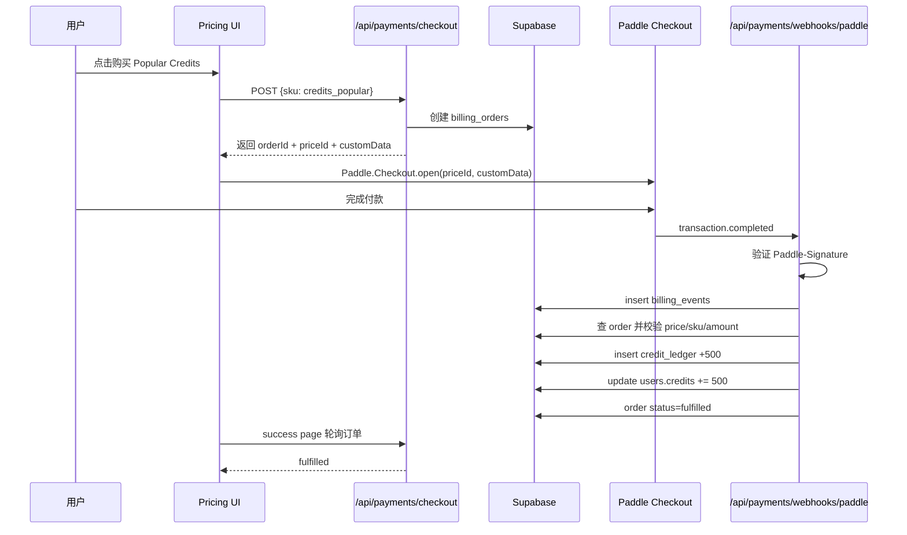
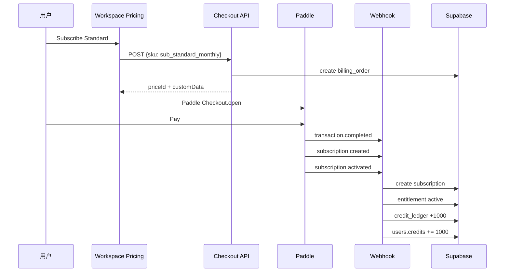
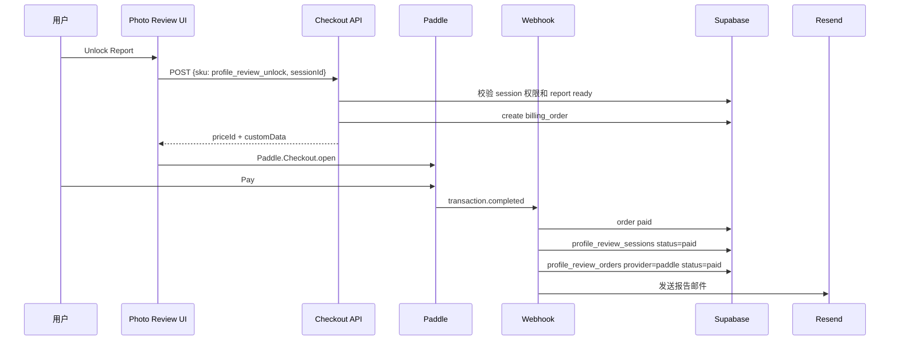

# Paddle 支付教程

日期：2026-05-06

官方资料核验日期：2026-05-06。Paddle AUP 页面当前标注的更新时间为 2026-04-13，因此本文对 dating、人像生成、stored value 的判断按该版本处理。

文件名说明：文件名按你的要求保存为 `Padlle支付教程.md`，正文统一使用正确品牌名 `Paddle`。

适用项目：`E:\AIProgram\video_generator`

本文档回答三个问题：

1. 以你当前条件，Paddle 是否可行。
2. 如果核心支付方案采用 Paddle，你需要手动准备和操作什么。
3. 当前 Next.js + Clerk + Supabase + credits 项目如何搭建完整 Paddle 支付链路。

本文不是法律、税务、外汇或支付合规意见。Paddle 的准入、AUP、支付方式、payout、税务和退款规则可能变化。上线前必须再次核对 Paddle 官方文档。

## 1. 结论：Paddle 是否可行

### 1.1 你的身份和主体条件

你的当前条件：

- 国内个人。
- 国内银行卡。
- 没有海外身份主体。
- 国内没有营业执照。

从 Paddle 当前公开资料看，**身份和主体条件上可以尝试 Paddle，但不是保证通过**。

原因：

- Paddle 支持来自全球大多数国家/地区的软件业务，中国不在其 unsupported countries 列表中。  
  官方来源：<https://www.paddle.com/help/legal/sanctions/which-countries-are-supported-by-paddle>
- Paddle 账户验证分为 domain review、business verification、identity verification。官方说明 business verification 对 individual 或 sole trader 不要求。  
  官方来源：<https://www.paddle.com/help/start/account-verification/what-is-account-verification>
- 如果你以 individual 或 sole trader 申请，身份验证由你本人完成，Paddle 会通过 Onfido 要求填写个人信息、拍摄身份证件、视频自拍。  
  官方来源：<https://www.paddle.com/help/start/account-verification/what-is-identity-verification>

也就是说：

- **没有海外公司不一定阻断 Paddle**。
- **没有国内营业执照不一定阻断 Paddle**。
- **必须能通过个人身份验证和域名/产品审核**。

### 1.2 国内银行卡是否满足 payout

国内银行卡不等于一定可收 Paddle payout。

Paddle payout 官方信息：

- Paddle 不是随时提现，而是月度 payout。
- 默认最低 payout threshold 是 USD 100 或对应币种。
- Payout 方式包括 wire transfer 或 Payoneer。
- Paddle 官方列出 CNY 为支持 payout currency。
- Paddle 不额外收 payout fee，但银行、SWIFT 或 Payoneer 可能收费。

官方来源：

- <https://www.paddle.com/help/manage/get-paid/when-and-how-do-i-get-paid>
- <https://www.paddle.com/help/manage/get-paid/can-i-be-paid-in-my-local-currency>
- <https://www.paddle.com/help/manage/get-paid/how-do-i-set-up-my-payout-settings>
- <https://www.paddle.com/help/manage/get-paid/is-there-a-fee-taken-for-payouts>

你需要确认：

- 国内银行卡所属银行能否接收国际汇款。
- 是否能提供 SWIFT/BIC、银行英文名、银行英文地址、账户名、账户号。
- 账户名是否和 Paddle 个人身份一致。
- 如果国内银行收款不顺，是否准备 Payoneer 作为备用。

结论：

- **只有一张普通国内银行卡还不够**。
- 你至少需要一张能接收跨境汇款的银行账户，或者准备 Payoneer。

### 1.3 最大阻碍不是身份，而是产品风险

当前项目有两个高风险点：

1. AI 人像/图像生成。
2. `dating-profile-review` 照片评分/约会资料优化链路。

Paddle AUP 对以下内容非常敏感：

- adult/dating services/applications。
- human-like faces in realistic, stylized, or animated forms。
- face swaps。
- deepfake images or videos。
- voice impersonations。
- 未经授权使用某人的 likeness。
- automated decision-making or categorization of people。

官方来源：<https://www.paddle.com/help/start/intro-to-paddle/what-am-i-not-allowed-to-sell-on-paddle>

补充说明：Paddle AUP 当前版本把 dating services/applications 列入 prohibited categories；把人脸生成、face swap、deepfake、未经同意使用 likeness、对人进行自动化决策或分类列入 content generation 相关高风险项，其中 human-like faces 是 Restricted Category，需要增强尽调。也就是说，这不是普通“支付通道是否支持 AI”的问题，而是产品是否会被 Paddle 风控接受的问题。

因此，当前项目如果原样申请 Paddle，风险较高：

- `dating-profile-review` 这个命名可能被判断为 dating services/applications。
- 人像生成可能触发 content generation restricted/enhanced due diligence。
- 照片评分如果被解释为对人的吸引力、约会价值、社会分类进行自动判断，也可能触发风险。
- credits 如果表达不当，可能被误解为 stored value、gift card、voucher 类金融/储值产品。

### 1.4 最终判断

**Paddle 作为核心支付方案可以尝试，但当前项目不能原样提交审核。**

你的条件满足程度：

| 项目 | 是否满足 | 说明 |
| --- | --- | --- |
| 中国个人地区 | 基本可尝试 | 中国不在 Paddle unsupported countries 中 |
| 无海外主体 | 基本可尝试 | Paddle 有 individual/sole trader 路径 |
| 无国内营业执照 | 基本可尝试 | individual/sole trader 不要求 business verification |
| 国内银行卡 | 不完全满足 | 需要可接收跨境 wire 的银行资料，或 Payoneer |
| 网站 | 目前需补齐 | 需要域名、HTTPS、政策页面、清晰产品说明 |
| AI 图像/人像生成 | 高风险 | 需安全政策、内容审核、禁止 deepfake/face swap/NSFW |
| dating profile review | 高风险 | 建议改名、改定位或先不上 Paddle |
| credits 积分包 | 中高风险 | 必须说明为非转让、无现金价值、只能消耗的 usage quota |
| 低价商品 USD 3.99 / 9.99 | 有定价风险 | Paddle pricing 页面提示低于 USD 10 的产品需联系销售 |

推荐路线：

1. 先用 Paddle 做 **订阅套餐**，例如 USD 30/month、USD 60/month。
2. credits 改名为 **generation quota / usage credits**，明确无现金价值、不可转让、不可提现。
3. USD 9.99 starter 建议调到 USD 10.99 或更高，或者先不上。
4. USD 3.99 profile review unlock 建议暂缓，先向 Paddle 预审；否则被拒概率高。
5. `dating-profile-review` 对外改成 `AI Photo Quality Review` 或 `Profile Photo Analysis Report`，避免 dating service 定位。
6. 禁止并技术上阻断 NSFW、deepfake、face swap、public figure likeness、unauthorized likeness。

## 2. Paddle 官方规则要点

### 2.1 Paddle 是 MoR

Paddle 是 SaaS Merchant of Record。

Paddle 处理：

- payment routing
- tax collection
- compliance
- invoicing
- subscription management
- renewals
- reporting
- fraud protection
- buyer billing support

官方来源：<https://www.paddle.com/seller-guides/seller-handbook>

### 2.2 Paddle 支持国家

Paddle 支持全球软件业务，除 unsupported countries 之外。中国不在 unsupported list。

官方来源：<https://www.paddle.com/help/legal/sanctions/which-countries-are-supported-by-paddle>

### 2.3 Paddle 支付方式

Paddle 支持的客户支付方式包括：

- Cards：
  - Visa
  - Mastercard
  - American Express
  - Maestro
  - Carte Bancaires
  - Diners Club
  - Discover
  - JCB
  - UnionPay
- South Korean local cards
- PayPal
- Alipay，需要额外审批
- Bancontact
- BLIK
- iDEAL
- MB WAY
- Naver Pay
- Kakao Pay
- Samsung Pay
- Payco
- Pix，early access
- UPI International，early access
- Apple Pay，Safari/兼容设备
- Google Pay，Chrome/兼容环境
- Wire Transfers / ACH，通常用于大于等于 USD 100 的一次性交易

官方来源：

- <https://www.paddle.com/help/start/intro-to-paddle/which-payment-methods-do-you-support>
- <https://developer.paddle.com/concepts/payment-methods/overview>

注意：

- Paddle Checkout 会根据客户国家、货币、设备、商品类型自动展示可用支付方式。
- Cards 默认开启。
- Alipay 需要额外审批。
- Paddle 文档说明 Alipay 在 Paddle Checkout 中只会在商品以 CNY 定价、客户地址为中国时展示。  
  官方来源：<https://developer.paddle.com/concepts/payment-methods/alipay>

### 2.4 Paddle 费用

Paddle 官方 pricing 页面显示 pay-as-you-go 为：

- 5% + USD 0.50 per Checkout transaction。
- 无 setup fees、monthly fees、hidden extras。
- 低于 USD 10 的产品或 invoice 需求需要联系 Paddle。

官方来源：<https://www.paddle.com/pricing>

对当前价格的影响：

- `profile_review_unlock = USD 3.99` 不适合直接作为 Paddle 核心商品，需联系 Paddle 或调价/合并销售。
- `credits_starter = USD 9.99` 也低于 USD 10，建议调到 USD 10.99 或以上。
- 订阅 USD 30、USD 60 更适合 Paddle。

### 2.5 Paddle 网站和条款要求

Paddle seller handbook 要求软件 seller：

- 有网站，并通过网站或 SDK 收款。
- 不要直接把 checkout link 发给买家收款。
- 不接触买家的卡信息。
- 网站 T&C 加入指定 MoR 文案。
- 清楚说明买家买了什么、价格是多少、是否订阅。
- 清楚列出 T&C、Refund Policy、buyer support details。
- Terms 中包含公司名或 sole proprietor brand，个人建议使用 legal name 或品牌名。
- 买家付款前要接受 T&C 和 refund policy。
- 支付完成后确保不中断交付/激活。
- 不销售 unsupported products。

官方来源：<https://www.paddle.com/seller-guides/seller-handbook>

需要放入网站 Terms 的文案：

```text
Our order process is conducted by our online reseller Paddle.com. Paddle.com is the Merchant of Record for all our orders. Paddle provides all customer service inquiries and handles returns.
```

## 3. Paddle 上线前产品整改

### 3.1 必须改掉的高风险表达

当前项目中建议避免：

- Dating Profile Review
- dating service
- improve dating matches
- get more dates
- attractiveness score
- hotness score
- AI girlfriend/boyfriend
- NSFW
- uncensored
- face swap
- deepfake
- celebrity
- generate anyone

建议替换成：

- AI Photo Quality Review
- Profile Photo Analysis Report
- Photo Quality Score
- Composition and Lighting Analysis
- AI Image & Video Generation Workspace
- Generation Quota
- Usage Credits
- Non-transferable quota

### 3.2 对 profile review 的处理建议

如果以 Paddle 为核心支付方案，建议分阶段：

第一阶段：

- 不上线 `dating-profile-review` 付费。
- 只上线 AI SaaS 订阅和通用 credits。

第二阶段：

- 把 `dating-profile-review` 改为 `AI Photo Quality Review`。
- 去掉约会、匹配、吸引力承诺。
- 把报告定位为：
  - 图片清晰度
  - 构图
  - 光线
  - 背景
  - 表情自然度
  - 图片顺序建议
- 明确：
  - 不判断人的价值。
  - 不做 dating matching。
  - 不提供社交/约会服务。
  - 不处理未成年人。
  - 只分析用户授权上传的照片。
- 向 Paddle support/dashboard 提交预审说明，通过后再接入 Paddle 收款。

第三阶段：

- 如果 Paddle 仍认为该功能属于 dating services 或 automated categorization of people，则不要通过 Paddle 销售该功能。

### 3.3 对 AI 生成的处理建议

必须在产品和技术上禁止：

- NSFW/adult。
- minors。
- face swap。
- deepfake。
- public figure likeness。
- celebrity likeness。
- unauthorized person likeness。
- voice impersonation。
- misleading synthetic media。
- 侵权 logo/IP。

建议增加：

- prompt moderation。
- upload moderation。
- output moderation。
- 用户上传授权 checkbox。
- AI Content Policy。
- Abuse report。
- 违规封禁。

### 3.4 对 credits 的处理建议

Paddle AUP 中对 virtual currency/stored value/gift cards/vouchers 有风险表达。当前项目的 credits 不能像储值钱包一样描述。

建议：

- 不叫 “wallet balance”。
- 不承诺现金价值。
- 不允许转让。
- 不允许提现。
- 不允许兑换现金。
- 不允许用户之间交易。
- 只作为本 SaaS 内部的 **usage quota**。

建议文案：

```text
Credits are non-transferable usage units for AI generations inside this software. Credits have no cash value, cannot be withdrawn, cannot be transferred, and cannot be exchanged for money or third-party goods.
```

中文解释：

```text
Credits 是本软件内部用于 AI 生成的非转让使用额度，没有现金价值，不能提现，不能转让，不能兑换现金或第三方商品。
```

## 4. 手动操作教程：申请和配置 Paddle

### 4.1 准备资料

你需要准备：

- 个人身份证。
- 护照，建议准备。
- 本人真实姓名英文/Pinyin。
- 居住地址英文。
- 手机号。
- 邮箱。
- 可访问的 HTTPS 域名。
- support 邮箱。
- support 电话，Paddle handbook 提到 buyer support details 包含 email 和 phone，建议准备一个可用号码。
- 国内银行 SWIFT/BIC 信息，或 Payoneer。
- 产品页面。
- Pricing 页面。
- Terms。
- Privacy Policy。
- Refund Policy。
- Acceptable Use Policy。
- AI Content Policy。
- 退款和交付说明。
- 测试账号。
- 产品 demo 或截图。

### 4.2 注册 Paddle 账户

手动步骤：

1. 打开 <https://www.paddle.com>。
2. 点击 Sign up 或 Get started。
3. 使用你的常用业务邮箱注册。
4. 如果选择 account type，选择 individual、sole trader 或与你实际情况最接近的非公司路径。
5. 不要填写不存在的公司或海外主体。
6. 登录 Paddle dashboard。
7. 开启 Two-Factor Authentication。

注意：

- Paddle sandbox 和 live 是分开的环境。
- 推荐先进入 live 提交 domain/account verification，因为审核可能需要几天。
- 同时用 sandbox 做技术集成。

### 4.3 提交 Domain Review / Website Approval

Paddle 要求 live 账户的 checkout 域名通过 approval。

手动步骤：

1. 登录 Paddle dashboard。
2. 进入 `Checkout`。
3. 找到 `Website approval` 或 `Request domain approval`。
4. 添加你的生产域名，例如：

```text
https://yourdomain.com
```

5. 确保网站能打开，并包含：
   - 首页。
   - Pricing。
   - Terms。
   - Privacy。
   - Refund Policy。
   - Acceptable Use Policy。
   - AI Content Policy。
   - Contact/Support。
6. 提交审核。
7. 等待 Paddle 审核。

官方说明：

- sandbox 网站会自动批准。
- live 网站审核可能需要几天。
- domain review 会检查你拥有使用 Paddle Checkout 的域名，以及产品是否符合 Paddle AUP。

官方来源：

- <https://developer.paddle.com/build/tools/sandbox>
- <https://developer.paddle.com/build/transactions/default-payment-link>
- <https://developer.paddle.com/build/onboarding/set-up-checklist>

### 4.4 完成身份验证

手动步骤：

1. 在 Paddle dashboard 查找 Account Verification。
2. 按提示提交个人/业务信息。
3. 如果是 individual 或 sole trader，business verification 通常不要求。
4. 等待 Paddle 发送 Onfido identity verification 邮件。
5. 点击邮件中的验证链接。
6. 填写个人信息。
7. 上传身份证件照片。
8. 完成视频自拍。
9. 等待审核。

官方说明：

- 个人或 sole trader 本人完成 identity verification。
- 通常即时完成；如果人工审核，目标时间约 1-3 个工作日，但可能受资料或队列影响。

官方来源：<https://www.paddle.com/help/start/account-verification/what-is-identity-verification>

### 4.5 配置 Payout Settings

手动步骤：

1. 登录 Paddle dashboard。
2. 进入 `Payout Settings`、`Transfer Preferences` 或 `Get paid`。
3. 选择 payout method：
   - Wire Transfer。
   - Payoneer。
4. 如果选择国内银行 wire：
   - 填写 account name，必须和身份一致。
   - 填写 bank name 英文。
   - 填写 bank address 英文。
   - 填写 SWIFT/BIC。
   - 填写 account number。
   - 按要求填写 branch code、bank code 等。
5. 如果选择 Payoneer：
   - 绑定 Payoneer 账户。
6. 设置 payout threshold，最低 USD 100 或对应币种。
7. 选择 payout currency，优先尝试 CNY 或 USD，具体以 dashboard 可选项为准。

注意：

- Paddle 每月 payout，不是随时提现。
- 每月 1 日余额达到 threshold 后进入 payout。
- Paddle 通常在每月 15 日前发出。
- 发送后到账可能还需要最多 3 个工作日，取决于银行。
- 国内银行可能收中转行或入账手续费。

官方来源：

- <https://www.paddle.com/help/manage/get-paid/when-and-how-do-i-get-paid>
- <https://www.paddle.com/help/manage/get-paid/how-do-i-set-up-my-payout-settings>

### 4.6 设置 Default Payment Link

Paddle 要求必须设置 default payment link。

手动步骤：

1. 登录 Paddle dashboard。
2. 进入 `Checkout > Checkout settings`。
3. 找到 `Default payment link`。
4. sandbox 可以填：

```text
http://localhost:3000/payments/paddle
```

或：

```text
https://localhost/
```

5. live 必须填已 approved domain 下的页面，例如：

```text
https://yourdomain.com/payments/paddle
```

6. 点击 Save。

注意：

- 该页面必须加载 Paddle.js。
- 当 URL 包含 `_ptxn=txn_...` 时，Paddle.js 会自动打开对应 transaction checkout。
- sandbox 和 live 要分别设置。

官方来源：

- <https://developer.paddle.com/build/transactions/default-payment-link>
- <https://developer.paddle.com/errors/transactions/transaction_default_checkout_url_not_set>

### 4.7 创建产品和价格

Paddle Catalog 由 Product 和 Price 组成。

官方来源：<https://developer.paddle.com/build/products/create-products-prices>

建议先创建这些产品：

| 内部 SKU | Paddle Product | Paddle Price | 类型 | 建议 |
| --- | --- | --- | --- | --- |
| `sub_mini_monthly` | Mini Plan | USD 9/month 或调高 | recurring | 低于 USD 10 有定价风险，建议确认 |
| `sub_standard_monthly` | Standard Plan | USD 30/month | recurring | 推荐首发 |
| `sub_plus_monthly` | Plus Plan | USD 60/month | recurring | 推荐首发 |
| `credits_popular` | Popular Usage Credits | USD 39.99 one-time | one-time | 可首发 |
| `credits_pro` | Pro Usage Credits | USD 69.99 one-time | one-time | 可首发 |
| `credits_starter` | Starter Usage Credits | USD 10.99 one-time | one-time | 建议从 9.99 调到 10.99 |
| `profile_review_unlock` | AI Photo Quality Review Report | USD 9.99+ 或暂缓 | one-time | 建议先预审，不建议 3.99 直接上 |

手动步骤：

1. Paddle dashboard 进入 `Catalog > Products`。
2. 点击 `New product`。
3. 填写 product name。
4. 选择 tax category：
   - 软件/SaaS/数字产品，具体以 Paddle dashboard 选项为准。
5. 写清 product description。
6. 保存。
7. 进入 product detail。
8. 点击 `New price`。
9. 选择：
   - one-time charge，适合 credits。
   - recurring，适合 subscription。
10. 设置金额、币种、周期。
11. 保存。
12. 复制 Paddle price id，形如：

```text
pri_01...
```

13. 写入环境变量。

推荐产品描述：

```text
Non-transferable usage quota for AI image/video generation inside the software. Credits have no cash value, cannot be withdrawn, cannot be transferred, and cannot be exchanged for money or third-party goods.
```

订阅描述：

```text
Monthly software subscription that grants access to AI generation features and a monthly non-transferable generation quota.
```

不要写：

- stored value
- gift card
- wallet
- dating service
- face swap
- deepfake
- uncensored

### 4.8 开启支付方式

手动步骤：

1. 进入 `Checkout > Checkout settings`。
2. 确认 Cards 开启。
3. 开启 PayPal。
4. 开启 Apple Pay / Google Pay，视 dashboard 选项而定。
5. 如果需要 Alipay：
   - 先点击 request approval。
   - 确认产品不在支付宝禁限售范围。
   - 通过后再开启。
6. 不要一开始强行依赖 Alipay/WeChat/本地支付。

建议：

- 初期面向欧美市场：Cards + PayPal + Apple Pay + Google Pay。
- 中国用户：等 Alipay 审批通过后再做 CNY price override。

### 4.9 创建 API Key 和 Client-side Token

手动步骤：

1. Paddle dashboard 进入 `Developer Tools > Authentication`。
2. 创建 server API key。
3. 创建 client-side token。
4. 分别复制 sandbox 和 live 的 key/token。
5. 写入 `.env.local` 和 Vercel 环境变量。

环境变量建议：

```env
BILLING_PROVIDER=paddle
PADDLE_ENVIRONMENT=sandbox
NEXT_PUBLIC_APP_URL=http://localhost:3000

PADDLE_API_KEY=
NEXT_PUBLIC_PADDLE_ENVIRONMENT=sandbox
NEXT_PUBLIC_PADDLE_CLIENT_TOKEN=
PADDLE_WEBHOOK_SECRET=

PADDLE_PRICE_CREDITS_STARTER=
PADDLE_PRICE_CREDITS_POPULAR=
PADDLE_PRICE_CREDITS_PRO=
PADDLE_PRICE_SUB_MINI_MONTHLY=
PADDLE_PRICE_SUB_STANDARD_MONTHLY=
PADDLE_PRICE_SUB_PLUS_MONTHLY=
PADDLE_PRICE_PROFILE_REVIEW_UNLOCK=
```

生产环境：

```env
PADDLE_ENVIRONMENT=live
NEXT_PUBLIC_APP_URL=https://yourdomain.com
```

注意：

- `PADDLE_API_KEY` 只能服务端使用。
- `NEXT_PUBLIC_PADDLE_CLIENT_TOKEN` 可以在浏览器使用。
- `PADDLE_WEBHOOK_SECRET` 只能服务端使用。
- 不要把 `PADDLE_API_KEY` 暴露给前端。

### 4.10 配置 Webhook Notification Destination

官方来源：

- <https://developer.paddle.com/webhooks/overview>
- <https://developer.paddle.com/webhooks/signature-verification>

手动步骤：

1. Paddle dashboard 进入 `Developer Tools > Notifications`。
2. 点击创建 notification destination。
3. 类型选择 URL/webhook。
4. URL 填：

```text
https://yourdomain.com/api/payments/webhooks/paddle
```

本地开发用 ngrok/cloudflared 临时地址：

```text
https://xxxxx.ngrok-free.app/api/payments/webhooks/paddle
```

5. 选择事件。

建议订阅事件：

一次性付款：

- `transaction.created`
- `transaction.paid`
- `transaction.completed`
- `transaction.canceled`
- `transaction.updated`

订阅：

- `subscription.created`
- `subscription.activated`
- `subscription.updated`
- `subscription.past_due`
- `subscription.paused`
- `subscription.resumed`
- `subscription.canceled`

退款/调整：

- dashboard 中可选的 adjustment/refund 相关事件，以当前 Paddle 事件列表为准。

6. 保存。
7. 复制该 notification destination 的 endpoint secret key。
8. 写入：

```env
PADDLE_WEBHOOK_SECRET=
```

重要：

- `transaction.paid` 表示付款捕获成功，但 Paddle 还没完成内部处理。
- `transaction.completed` 表示交易完成并有更完整的 payout、invoice、subscription 信息。
- 一次性 credits 和报告解锁建议以 `transaction.completed` 作为最终交付事件。

官方来源：

- <https://developer.paddle.com/webhooks/transactions/transaction-paid>
- <https://developer.paddle.com/webhooks/transactions/transaction-completed>

## 5. 当前项目推荐技术链路

### 5.1 采用统一 billing layer

不要把 Paddle 写死在业务里。

推荐结构：

```text
lib/
  billing/
    catalog.ts
    types.ts
    orders.ts
    fulfill.ts
    events.ts
    providers/
      paddle.ts
app/
  api/
    payments/
      checkout/
        route.ts
      webhooks/
        paddle/
          route.ts
  payments/
    success/
      page.tsx
    cancel/
      page.tsx
    paddle/
      page.tsx
```

### 5.2 两种 Paddle Checkout 集成方式

#### 方式 A：Paddle.js 直接打开 Checkout，适合 MVP

流程：

1. 后端创建内部 `billing_order`。
2. 后端返回：
   - `orderId`
   - `paddlePriceId`
   - `customData`
3. 前端调用 `Paddle.Checkout.open()`。
4. Paddle 自动创建 transaction。
5. Webhook 带回 `custom_data.order_id`。
6. 后端验证金额、price、sku、order 后交付。

优点：

- 实现快。
- Paddle 推荐自助 checkout 场景。
- 不需要后端先创建 Paddle transaction。

缺点：

- price id 在前端可见。
- 必须在 webhook 中强校验 transaction items 是否匹配内部订单。

#### 方式 B：后端先创建 Paddle Transaction，适合更严格的生产链路

流程：

1. 后端创建内部 `billing_order`。
2. 后端调用 Paddle API 创建 transaction，写入 `custom_data.order_id`。
3. Paddle 返回 `checkout.url`。
4. 前端跳转 `checkout.url`。
5. 默认支付页加载 Paddle.js 并打开 checkout。
6. Webhook 根据 transaction id 和 custom_data 交付。

优点：

- 后端控制更强。
- 内部 order 和 Paddle transaction 绑定更早。
- 更适合对账。

缺点：

- 需要设置 default payment link。
- API 细节更多。

推荐：

- 第一版用 **方式 A** 快速接入。
- 稳定后升级到 **方式 B**。

## 6. 数据库设计

建议新增通用支付表，不继续依赖旧 `transactions` 表。

```sql
create extension if not exists "uuid-ossp";

create table if not exists billing_orders (
  id uuid primary key default uuid_generate_v4(),
  user_id text not null references users(id) on delete cascade,
  email text,
  provider text not null default 'paddle',
  product_type text not null check (
    product_type in ('credits', 'subscription', 'profile_review_unlock')
  ),
  sku text not null,
  status text not null default 'created' check (
    status in (
      'created',
      'checkout_opened',
      'payment_pending',
      'paid',
      'fulfilled',
      'failed',
      'cancelled',
      'refunded',
      'disputed'
    )
  ),
  amount integer not null,
  currency text not null default 'usd',
  quantity integer not null default 1,
  provider_checkout_id text,
  provider_transaction_id text,
  provider_subscription_id text,
  provider_customer_id text,
  metadata jsonb not null default '{}'::jsonb,
  paid_at timestamptz,
  fulfilled_at timestamptz,
  created_at timestamptz not null default now(),
  updated_at timestamptz not null default now()
);

create index if not exists idx_billing_orders_user_created
  on billing_orders(user_id, created_at desc);

create index if not exists idx_billing_orders_provider_transaction
  on billing_orders(provider, provider_transaction_id);

create table if not exists billing_events (
  id uuid primary key default uuid_generate_v4(),
  provider text not null default 'paddle',
  provider_event_id text not null,
  event_type text not null,
  order_id uuid references billing_orders(id) on delete set null,
  provider_transaction_id text,
  provider_subscription_id text,
  raw_payload jsonb not null,
  received_at timestamptz not null default now(),
  processed_at timestamptz,
  processing_error text,
  unique(provider, provider_event_id)
);

create table if not exists credit_ledger (
  id uuid primary key default uuid_generate_v4(),
  user_id text not null references users(id) on delete cascade,
  order_id uuid references billing_orders(id) on delete set null,
  generation_id uuid references generations(id) on delete set null,
  delta integer not null,
  balance_after integer,
  reason text not null check (
    reason in (
      'purchase',
      'subscription_grant',
      'generation_spend',
      'refund',
      'admin_adjustment',
      'chargeback_reversal'
    )
  ),
  idempotency_key text not null unique,
  metadata jsonb not null default '{}'::jsonb,
  created_at timestamptz not null default now()
);

create table if not exists subscriptions (
  id uuid primary key default uuid_generate_v4(),
  user_id text not null references users(id) on delete cascade,
  provider text not null default 'paddle',
  provider_subscription_id text not null,
  sku text not null,
  status text not null,
  current_period_start timestamptz,
  current_period_end timestamptz,
  cancel_at_period_end boolean not null default false,
  metadata jsonb not null default '{}'::jsonb,
  created_at timestamptz not null default now(),
  updated_at timestamptz not null default now(),
  unique(provider, provider_subscription_id)
);
```

## 7. 商品目录

`lib/billing/catalog.ts`

```ts
export const BILLING_CATALOG = {
  credits_starter: {
    sku: "credits_starter",
    productType: "credits",
    name: "Starter Usage Credits",
    amount: 1099,
    currency: "usd",
    credits: 100,
    paddlePriceEnv: "PADDLE_PRICE_CREDITS_STARTER",
  },
  credits_popular: {
    sku: "credits_popular",
    productType: "credits",
    name: "Popular Usage Credits",
    amount: 3999,
    currency: "usd",
    credits: 500,
    paddlePriceEnv: "PADDLE_PRICE_CREDITS_POPULAR",
  },
  credits_pro: {
    sku: "credits_pro",
    productType: "credits",
    name: "Pro Usage Credits",
    amount: 6999,
    currency: "usd",
    credits: 1000,
    paddlePriceEnv: "PADDLE_PRICE_CREDITS_PRO",
  },
  sub_standard_monthly: {
    sku: "sub_standard_monthly",
    productType: "subscription",
    name: "Standard Plan",
    amount: 3000,
    currency: "usd",
    monthlyCredits: 1000,
    paddlePriceEnv: "PADDLE_PRICE_SUB_STANDARD_MONTHLY",
  },
  sub_plus_monthly: {
    sku: "sub_plus_monthly",
    productType: "subscription",
    name: "Plus Plan",
    amount: 6000,
    currency: "usd",
    monthlyCredits: 2500,
    paddlePriceEnv: "PADDLE_PRICE_SUB_PLUS_MONTHLY",
  },
} as const;
```

建议第一阶段不要把 `profile_review_unlock` 放进 Paddle catalog，除非 Paddle 明确审批通过。

## 8. Checkout API 设计

接口：

```text
POST /api/payments/checkout
```

请求：

```json
{
  "sku": "credits_popular"
}
```

响应：

```json
{
  "orderId": "uuid",
  "email": "user@example.com",
  "provider": "paddle",
  "paddlePriceId": "pri_01...",
  "customData": {
    "order_id": "uuid",
    "user_id": "user_...",
    "sku": "credits_popular",
    "product_type": "credits",
    "credits": "500"
  }
}
```

后端步骤：

1. Clerk auth 获取用户。
2. 获取 email。
3. 校验 SKU。
4. 创建 `billing_orders`。
5. 把 order id 和 SKU 写入 metadata。
6. 返回 Paddle price id 和 customData。

注意：

- 前端不能传 amount。
- 前端不能传 credits。
- 前端不能选择 provider。
- webhook 必须校验 Paddle transaction 中的 items price id 和内部订单一致。

## 9. Paddle.js 前端接入

页面加载 Paddle.js：

```tsx
import Script from "next/script";

export function PaddleScript() {
  return (
    <Script
      src="https://cdn.paddle.com/paddle/v2/paddle.js"
      strategy="afterInteractive"
      onLoad={() => {
        window.Paddle.Environment.set(
          process.env.NEXT_PUBLIC_PADDLE_ENVIRONMENT === "sandbox"
            ? "sandbox"
            : "production"
        );

        window.Paddle.Initialize({
          token: process.env.NEXT_PUBLIC_PADDLE_CLIENT_TOKEN!,
        });
      }}
    />
  );
}
```

打开 checkout：

```tsx
async function startCheckout(sku: string) {
  const response = await fetch("/api/payments/checkout", {
    method: "POST",
    headers: { "Content-Type": "application/json" },
    body: JSON.stringify({ sku }),
  });

  const data = await response.json();

  if (!response.ok) {
    throw new Error(data.error || "Failed to create checkout");
  }

  window.Paddle.Checkout.open({
    items: [
      {
        priceId: data.paddlePriceId,
        quantity: 1,
      },
    ],
    customData: data.customData,
    customer: data.email
      ? {
          email: data.email,
        }
      : undefined,
    settings: {
      successUrl: `${window.location.origin}/payments/success?orderId=${data.orderId}`,
    },
  });
}
```

TypeScript 类型声明建议：

`types/paddle.d.ts`

```ts
export {};

declare global {
  interface Window {
    Paddle: {
      Environment: {
        set: (environment: "sandbox" | "production") => void;
      };
      Initialize: (options: { token: string }) => void;
      Checkout: {
        open: (options: {
          items?: Array<{ priceId: string; quantity: number }>;
          transactionId?: string;
          customData?: Record<string, unknown>;
          customer?: { email?: string };
          settings?: {
            displayMode?: "overlay" | "inline";
            variant?: "multi-page" | "one-page";
            successUrl?: string;
          };
        }) => void;
      };
    };
  }
}
```

注意：

- 生产中不要直接发 Paddle checkout link 给用户绕过网站。
- Paddle handbook 要求通过网站或 SDK 收款。
- 如果用户关闭 checkout，不做交付。
- 交付只等 webhook。

## 10. Webhook 签名验证

Paddle webhook 带 `Paddle-Signature` header。

签名逻辑：

1. 读取 raw body。
2. 从 header 提取 `ts` 和 `h1`。
3. 拼接：

```text
${ts}:${rawBody}
```

4. 用 endpoint secret key 做 HMAC SHA256。
5. 和 `h1` 做 timing-safe compare。
6. 通过后才解析 JSON。

官方来源：<https://developer.paddle.com/webhooks/signature-verification>

Next.js 示例：

```ts
import { createHmac, timingSafeEqual } from "crypto";
import { NextRequest, NextResponse } from "next/server";

function verifyPaddleSignature(rawBody: string, signatureHeader: string, secret: string) {
  const parts = Object.fromEntries(
    signatureHeader.split(";").map((part) => {
      const [key, value] = part.split("=");
      return [key, value];
    })
  );

  const timestamp = parts.ts;
  const signature = parts.h1;

  if (!timestamp || !signature) {
    return false;
  }

  const signedPayload = `${timestamp}:${rawBody}`;
  const expected = createHmac("sha256", secret)
    .update(signedPayload, "utf8")
    .digest("hex");

  const expectedBuffer = Buffer.from(expected, "hex");
  const actualBuffer = Buffer.from(signature, "hex");

  if (expectedBuffer.length !== actualBuffer.length) {
    return false;
  }

  return timingSafeEqual(expectedBuffer, actualBuffer);
}

export async function POST(req: NextRequest) {
  const rawBody = await req.text();
  const signature = req.headers.get("paddle-signature") || "";
  const secret = process.env.PADDLE_WEBHOOK_SECRET || "";

  if (!verifyPaddleSignature(rawBody, signature, secret)) {
    return NextResponse.json({ error: "Invalid signature" }, { status: 400 });
  }

  const event = JSON.parse(rawBody);

  // 先写 billing_events，再处理交付
  return NextResponse.json({ received: true });
}
```

## 11. Webhook 处理规则

### 11.1 一次性付款

使用 `transaction.completed` 作为交付事件。

处理：

1. 验签。
2. 获取 `event_id`。
3. 插入 `billing_events`，唯一键 `provider + event_id`。
4. 如果重复，返回 200。
5. 读取 `data.custom_data.order_id`。
6. 查内部 `billing_orders`。
7. 校验：
   - order 存在。
   - order 未 fulfilled。
   - provider 是 paddle。
   - SKU 匹配。
   - Paddle transaction items price id 匹配内部 SKU。
8. 更新 order：
   - `provider_transaction_id = data.id`
   - `status = paid`
   - `paid_at = now()`
9. 按 product type 交付：
   - credits：写 ledger，加余额。
   - profile review：解锁报告，前提是该功能已被 Paddle 批准。
10. 标记 order fulfilled。

### 11.2 订阅

关键事件：

- `subscription.created`
- `subscription.activated`
- `subscription.updated`
- `subscription.past_due`
- `subscription.paused`
- `subscription.resumed`
- `subscription.canceled`
- 续费相关 `transaction.completed`

处理：

- `subscription.activated`：
  - 创建/更新 subscriptions。
  - 开通 entitlement。
  - 首次发放月度 credits，或配合初始 transaction.completed 发放，必须幂等。
- renewal `transaction.completed`：
  - `origin = subscription_recurring` 时发放当月 credits。
- `subscription.past_due`：
  - 标记订阅逾期。
  - 可限制高级功能。
- `subscription.canceled`：
  - 更新订阅状态。
  - 到期后关闭 entitlement。

### 11.3 不要用 `transaction.paid` 直接交付

Paddle 文档说明：

- `transaction.paid` 表示支付捕获成功。
- 此时 Paddle 可能还未完成内部处理。
- transaction 之后会变成 `completed`。

所以：

- `transaction.paid` 可用于 UI 显示“支付处理中”。
- `transaction.completed` 才用于最终交付。

## 12. 数据流示例：购买 credits



## 13. 数据流示例：订阅



## 14. 数据流示例：报告解锁

只在 Paddle 预审通过后使用。



## 15. 退款、拒付和对账

### 15.1 Paddle 退款规则

Paddle refund policy 包含：

- 除法律要求外，交易通常 non-refundable/non-exchangeable。
- Paddle 可酌情退款。
- 部分国家/地区有法定撤销权。
- 中国、韩国、巴西消费者有 7 天无条件取消数字内容或服务合同的权利。
- EU/EEA/UK 等通常有 14 天撤销权，但数字内容开始交付且用户同意放弃撤销权时可能例外。

官方来源：<https://www.paddle.com/legal/refund-policy>

对当前项目影响：

- 支付前要让用户接受 Terms 和 Refund Policy。
- 数字内容即时交付时，要在流程中明确用户同意开始交付。
- 已使用 credits 或已交付报告，仍可能受当地消费者法律影响。
- 你的退款政策不能低于当地强制消费者权益。

### 15.2 拒付

Paddle handbook 提到：

- 买家可在付款后较长时间内 chargeback。
- Paddle 会代表你处理一部分争议。
- 你需要提供 Paddle 没有的证据，例如直接沟通和软件使用日志。
- dispute rate 需要保持低。

官方来源：<https://www.paddle.com/seller-guides/seller-handbook>

需要保存：

- order id。
- Paddle transaction id。
- customer email。
- payment timestamp。
- fulfillment timestamp。
- credits ledger。
- generation/report delivery logs。
- support conversation。
- 用户同意 Terms/Refund 的记录。

### 15.3 对账 SQL

```sql
-- 已支付但未交付
select *
from billing_orders
where provider = 'paddle'
  and status = 'paid'
  and fulfilled_at is null;

-- webhook 处理失败
select *
from billing_events
where provider = 'paddle'
  and processing_error is not null
order by received_at desc;

-- 重复 Paddle transaction
select provider_transaction_id, count(*)
from billing_orders
where provider = 'paddle'
  and provider_transaction_id is not null
group by provider_transaction_id
having count(*) > 1;
```

## 16. 上线测试清单

### 16.1 Sandbox 测试

- [ ] Paddle sandbox account 可登录。
- [ ] Sandbox default payment link 已设置。
- [ ] Sandbox client-side token 已创建。
- [ ] Sandbox API key 已创建。
- [ ] Sandbox notification destination 已配置。
- [ ] Products 和 prices 已创建。
- [ ] Checkout 能打开。
- [ ] `transaction.completed` webhook 能收到。
- [ ] Webhook 签名验证通过。
- [ ] 重复 webhook 不重复加 credits。
- [ ] success page 能轮询 order status。
- [ ] 退款 sandbox 测试。
- [ ] 订阅创建测试。
- [ ] 订阅取消测试。

### 16.2 Live 前检查

- [ ] 域名通过 Paddle approval。
- [ ] Account verification 通过。
- [ ] Identity verification 通过。
- [ ] Payout settings 配置完成。
- [ ] Terms 包含 Paddle 指定 MoR 文案。
- [ ] Pricing 页面写清订阅和 credits。
- [ ] Refund Policy 写清。
- [ ] AI Content Policy 写清。
- [ ] 买家付款前接受 Terms 和 Refund Policy。
- [ ] 生产环境变量已配置。
- [ ] Webhook endpoint 使用 HTTPS。
- [ ] 日志和对账 SQL 可用。

### 16.3 Live smoke test

1. 用真实卡购买一个最小可测商品。
2. 确认 Paddle dashboard 中 transaction completed。
3. 确认 Supabase `billing_events` 有事件。
4. 确认 order fulfilled。
5. 确认 credits 或订阅到账。
6. 从 Paddle dashboard 发起退款。
7. 确认系统反向处理或至少记录 refund event。

## 17. Paddle 申请预审文案

建议在 Paddle dashboard support 或审核说明里提交以下英文说明。

```text
Product:
AI image and video generation SaaS.

Business model:
Customers subscribe to monthly plans or purchase non-transferable usage credits to generate AI images/videos inside our software. Credits are internal usage quota only. They have no cash value, cannot be withdrawn, cannot be transferred, and cannot be exchanged for money or third-party goods.

Delivery:
All products are delivered digitally inside the user account. After Paddle confirms payment through webhook, the user's plan or usage quota is activated immediately.

AI safety:
We prohibit NSFW/adult content, minors, non-consensual imagery, face swaps, deepfakes, public figure impersonation, unauthorized likeness generation, voice impersonation, illegal content, and copyright infringement. We use prompt/upload/output moderation and suspend accounts that violate our policies.

Profile photo analysis:
We may offer an automated AI photo quality analysis report. This is not a dating service, not a dating app, not matchmaking, not social networking, and not human consulting. The report focuses on image quality factors such as lighting, composition, background, sharpness, and photo order. Users must confirm that they own or have permission to upload the images.

Policies:
Terms: https://yourdomain.com/terms
Privacy: https://yourdomain.com/privacy
Refund: https://yourdomain.com/refund
Acceptable Use: https://yourdomain.com/acceptable-use
AI Content Policy: https://yourdomain.com/ai-content-policy

Support:
support@yourdomain.com
```

## 18. Paddle 核心方案的推荐落地顺序

推荐顺序：

1. 先改网站文案和政策页面。
2. 提交 Paddle domain/account verification。
3. 只创建订阅和 USD 10+ 的 credits 产品。
4. 暂缓 profile review unlock。
5. 接 Paddle sandbox。
6. 实现 `billing_orders`、`billing_events`、`credit_ledger`。
7. 实现 Paddle Checkout。
8. 实现 Paddle webhook。
9. 完成 sandbox 全流程。
10. Live 审核通过后做 smoke test。
11. 上线订阅和 credits。
12. 拿 Paddle 对 profile/photo review 的明确回复后，再决定是否上线报告解锁。

## 19. 如果 Paddle 被拒怎么办

常见原因：

- 网站内容像 dating service。
- AI 生成人脸/深度伪造风险太高。
- credits 被误解为 stored value。
- 低价商品和退款风险过高。
- 网站没有完整政策页。
- 产品交付不清晰。

应对：

1. 删除 dating 相关文案。
2. 明确不是社交、匹配、约会服务。
3. 改 credits 为 usage quota。
4. 去掉低于 USD 10 的商品，或联系 Paddle custom pricing。
5. 增加 AI safety 页面。
6. 提交更清晰的产品 demo。
7. 如果仍拒绝，切换 Dodo Payments 或 Lemon Squeezy。

## 20. 最终建议

Paddle 可以作为核心支付方案尝试，但必须按“Paddle 合规优先”的方式改造项目。

最重要的判断：

- **你的个人身份和无营业执照条件：可尝试，不是主要阻碍。**
- **国内银行卡：需要确认能接收 wire，最好准备 Payoneer。**
- **当前产品形态：是主要阻碍，尤其 dating/profile review 和 AI 人像生成。**

最稳妥 Paddle 上线路线：

1. 首发只卖订阅和 USD 10+ 的 generation quota。
2. profile review 暂缓或改名后预审。
3. 所有 AI 风控政策和技术限制先补齐。
4. 使用 Paddle.js + webhook 交付。
5. 所有交付只依赖 `transaction.completed` 和 subscription lifecycle webhook。
6. 完整保留 order、event、credit ledger，方便对账和拒付证据。

如果你不愿意调整 dating/profile review 和人像生成风险，Paddle 通过概率会明显下降；这种情况下 Dodo Payments 可能更适合作为第一生产 MoR。

## 21. paddle_v1.0 当前落地状态

本节记录 2026-05-06 的 `paddle_v1.0` 修改批次。该批次按你的后续要求执行：**先不改变产品形态**，包括当前项目里的 `dating-profile-review`、AI 人像/脸部生成、credits 表述、USD 3.99 profile review unlock、USD 9.99 starter credits。

已落地代码入口：

- 通用 Paddle checkout：`/api/payments/checkout`
- profile review Paddle checkout：`/api/payments/profile-review/checkout`
- Paddle webhook：`/api/payments/webhooks/paddle`
- 全局 Paddle.js：`app/_components/paddle-script.tsx`
- 数据库迁移：`supabase/migrations/20260506_paddle_v1_billing.sql`
- billing catalog：`lib/billing/catalog.ts`
- webhook fulfillment：`lib/billing/fulfillment.ts`
- 审核提交材料：`docs/paddle_v1.0_审核提交材料.md`

当前交付规则：

- 前端只打开 Paddle Checkout，不直接交付。
- Webhook 先验证 `Paddle-Signature`。
- Webhook 先写入 `billing_events`，用 `provider + event_id` 幂等。
- 只有 `transaction.completed` 触发最终交付。
- credits 购买写入 `credit_ledger`，并更新 `users.credits`。
- 订阅付款写入 `subscriptions`，并按当前套餐发放月度 credits。
- profile review 付款写入 `profile_review_orders.provider = paddle`，更新 session paid/delivered，并发送报告邮件。

Paddle Dashboard 人工提交仍需由账号持有人完成：

1. 创建 Paddle products/prices。
2. 配置环境变量中的 Paddle price id。
3. 创建 client-side token、server API key、Notification Destination。
4. Webhook URL 使用 `https://yourdomain.com/api/payments/webhooks/paddle`。
5. 执行 `supabase/migrations/20260506_paddle_v1_billing.sql`。
6. 完成 sandbox 测试后提交 Domain Review 和产品审核。
